<div align="center">

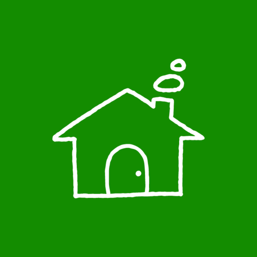

# 여행하게

### 출발은 혼자, 기억은 같이

혼자 떠나는 사람이 **여행 동행**을 만나고,<br>
**혼여행자를 위한 게스트하우스**에 머무는 앱.


**iOS · Android** &nbsp;·&nbsp; **2024.11 → 2026.06** &nbsp;·&nbsp; 화면 150여 개 &nbsp;·&nbsp; 개발 2명 + 디자이너 1명

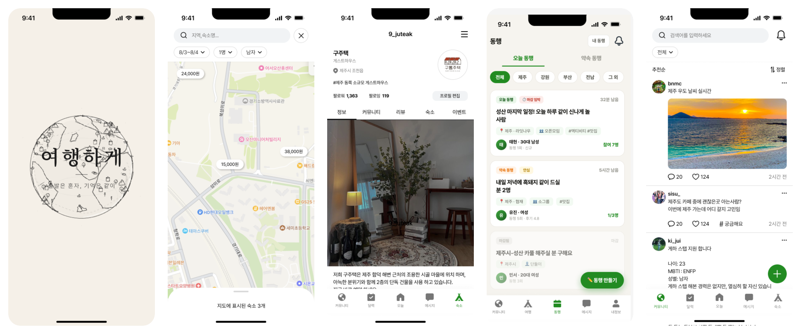

</div>

<br>

> [!NOTE]
> **프론트엔드 담당자의 시선에서 작성한 회고입니다.**
> 상용·팀 프로젝트라 앱 소스 전체는 담지 않았고, 설계 의도가 드러나는 부분만 시크릿을 걷어내고 발췌했습니다.
> 같은 프로젝트의 서버 이야기는 [pill27211/align-retrospective](https://github.com/pill27211/align-retrospective)에 따로 있습니다.

---

## 앱을 열면

앱을 처음 켠 사람이 **어떤 순서로 화면을 지나가는지** 그대로 따라가 보겠습니다. 각 화면에서 무엇을 고민했는지도 함께 적었습니다.

> [!NOTE]
> 프로젝트가 멈추면서 서버도 함께 내려가, 지금은 앱을 켜도 데이터가 오지 않습니다.
> 그래서 화면을 다시 보여줄 수 있도록 일부 화면은 **앱이 서버에 보내는 요청을 가로채 준비된 응답을 돌려주는 목 서버를 붙이고**, 실제 기기에서 앱을 띄워 촬영했습니다.

### 처음 만나는 화면

<table>
<tr>
<td width="34%"></td>
<td valign="middle">

<br>

`혼자 떠나는 게 이상한 거 아니에요.`
`하루를 마무리할 때쯤, 누군가 말을 걸어요.`
`어제의 낯선 사람이 내일 동행이 돼요.`

**설명이 필요한 서비스**라 여기서 개념이 전달되지 않으면 사용자는 그냥 나갑니다.

그래서 네 문장을 한 화면에 몰아넣지 않고 한 장에 하나씩 두었고, 각 화면 안에서도 제목 → 설명 → 이미지 순으로 시차를 줬습니다. **시선의 순서를 만드는 장치**였지 장식이 아니었습니다.

마지막 화면에서 소셜 로그인 네 종류로 이어집니다.

</td>
</tr>
</table>

### 숙소를 찾는다

<table>
<tr>
<td width="34%">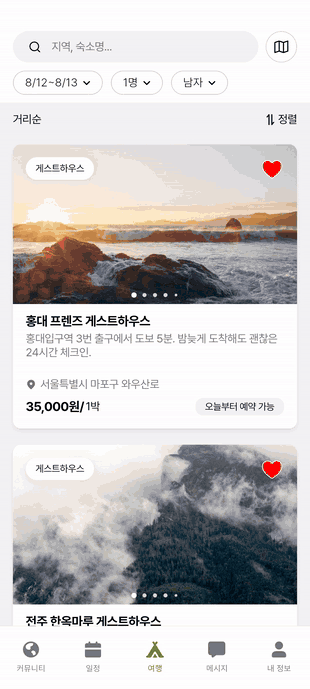</td>
<td width="34%">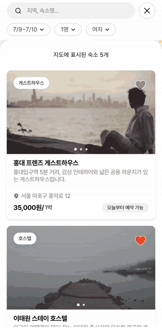</td>
<td valign="middle">

<br>

목록과 지도, 두 갈래로 찾습니다.

지도 쪽이 이 앱에서 **기술적으로 가장 많이 손을 댄 화면**입니다. 손가락이 움직이는 내내 카메라 콜백이 오는데, 그때마다 "이 화면의 숙소 주세요"라고 물으면 드래그 한 번에 요청이 수십 번 나갑니다.

한반도를 **2,066개의 고정 격자**로 나눠, 연속적인 좌표 문제를 정수 집합 문제로 바꿨습니다.

직접 재보니 **16번 드래그에 서버 호출은 1번**, 필요한 타일 64개 중 61개를 캐시가 받아냈습니다.

→ [지도 타일링](docs/02-map-tiling.md)

</td>
</tr>
</table>

### 고르고, 예약한다

<table>
<tr>
<td width="34%">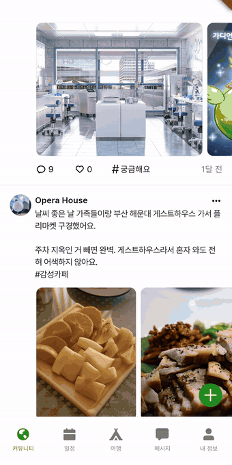</td>
<td width="34%">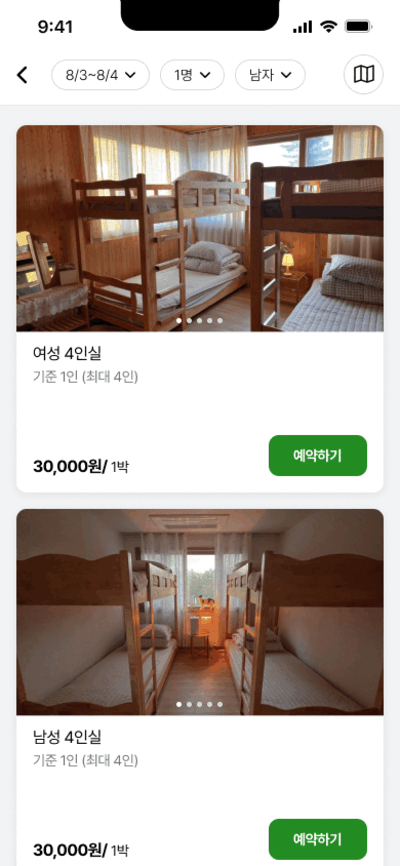</td>
<td valign="middle">

<br>

숙소를 고르기 전에 **공간과 호스트를 먼저** 보여주는 쪽으로 설계했습니다. 사진 · 편의시설 · 환불 규정 · 리뷰가 한 화면 안의 탭으로 붙어 있습니다.

예약은 객실 → 날짜 → 인원 → 확인의 네 단계입니다. 각 단계가 앞 단계의 선택에 따라 가능한 범위가 달라져서, 뒤로 돌아갔을 때 이미 고른 값이 어긋나지 않게 맞추는 일이 생각보다 손이 갔습니다.

</td>
</tr>
</table>

### 동행을 만든다

<table>
<tr>
<td width="34%">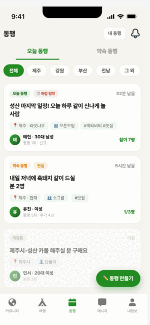</td>
<td valign="middle">

<br>

이 앱의 핵심입니다. 오늘 갈 동행을 찾거나 직접 만들고, 신청·수락을 거쳐 **자동으로 만들어진 그룹 채팅**에서 모입니다.

처음 만나는 사이라는 전제 때문에 화면에도 장치가 들어갔습니다. 신청 수락제, 후기, 그리고 **안심 동행 게이지** — 가입 기간·활동 이력 같은 조건을 채울수록 차오르는 지표입니다.

한 번에 다 묻지 않고 지역·날짜 → 소개 → 계획의 3단계로 쪼갠 것도 같은 이유입니다. 낯선 사람에게 보여줄 정보를 한 화면에서 결정하게 하면 부담이 큽니다.

</td>
</tr>
</table>

### 기록하고, 이어진다

<table>
<tr>
<td width="34%">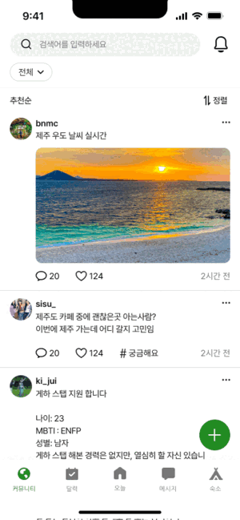</td>
<td width="34%">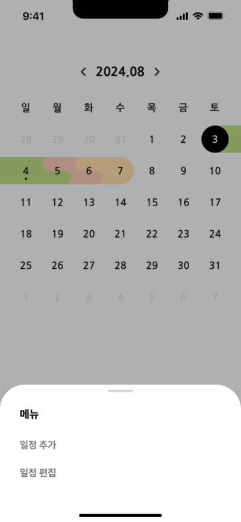</td>
<td valign="middle">

<br>

커뮤니티는 여행지에서 사진을 잔뜩 올리는 곳입니다. 네트워크가 불안정한 상태에서 사진 열 장을 걸어 놓고 앱을 나가는 게 **정상적인 사용 패턴**이라, 업로드를 앱 생명주기 밖으로 빼고 큐 자체를 디스크에 저장했습니다.

→ [백그라운드 업로드](docs/06-background-upload.md)

일정 탭은 예약과 동행이 모이는 곳입니다. 직접 추가한 일정도 함께 놓입니다.

</td>
</tr>
</table>

### 호스트가 된다

<table>
<tr>
<td width="34%">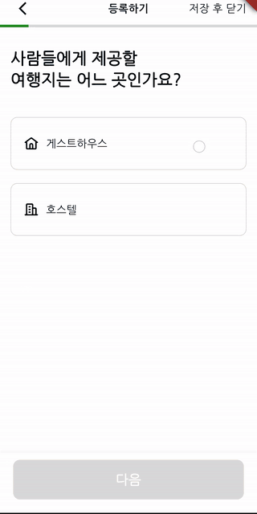</td>
<td width="34%">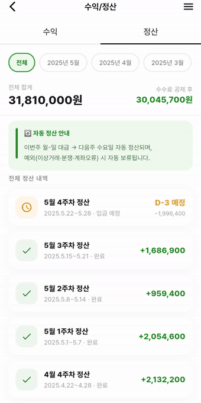</td>
<td valign="middle">

<br>

게스트 앱과 호스트 앱이 **한 바이너리 안에** 들어 있습니다. 권한이 바뀌면 하단 탭 다섯 개가 통째로 교체됩니다.

| | 탭 구성 |
|---|---|
| 게스트 | 커뮤니티 · 일정 · 여행 · 메시지 · 내 정보 |
| 호스트 | 커뮤니티 · 달력 · 오늘 · 메시지 · 숙소 |

두 모드는 사실상 다른 앱이라 화면 안에서 `if (isHost)`로 나누지 않고 셸 수준에서 갈랐습니다. 조건문으로 시작하면 그게 모든 화면으로 번집니다.

호스트 콘솔만 파일이 89개입니다. 숙소 등록은 유형 → 위치 → 객실 → 편의시설 → 정책 순의 다단계 마법사이고, 정산은 주차 단위로 수수료를 빼고 입금 예정일까지 보여줍니다.

</td>
</tr>
</table>

> [!NOTE]
> 위 GIF의 동행 화면에는 `동행` 탭이 하단에 보이는데, 마지막으로 빌드된 코드의 탭 구성은 위 표와 같습니다. 동행을 별도 탭으로 끌어올리는 개편이 진행 중이었고 **코드에 반영되기 전에 프로젝트가 멈췄습니다.**

---

## 화면 전부

<details>
<summary><b>🔍 &nbsp;탐색 · 숙소</b> &nbsp;— &nbsp;목록 · 검색 · 날짜 · 지도 · 상세 · 리뷰</summary>
<br>
<table>
<tr>
<td align="center" width="25%">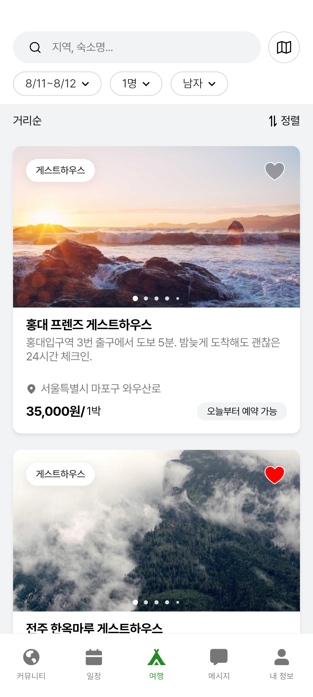<br><sub><b>숙소 목록</b><br>거리순 · 필터 · 찜</sub></td>
<td align="center" width="25%">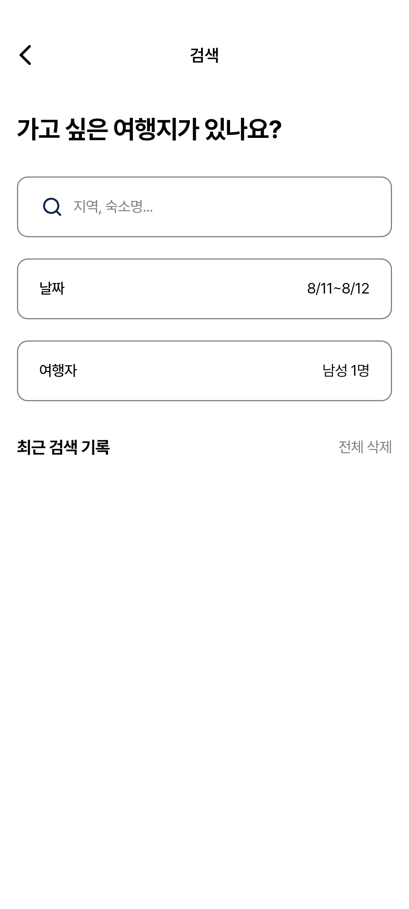<br><sub><b>검색</b><br>최근 검색</sub></td>
<td align="center" width="25%">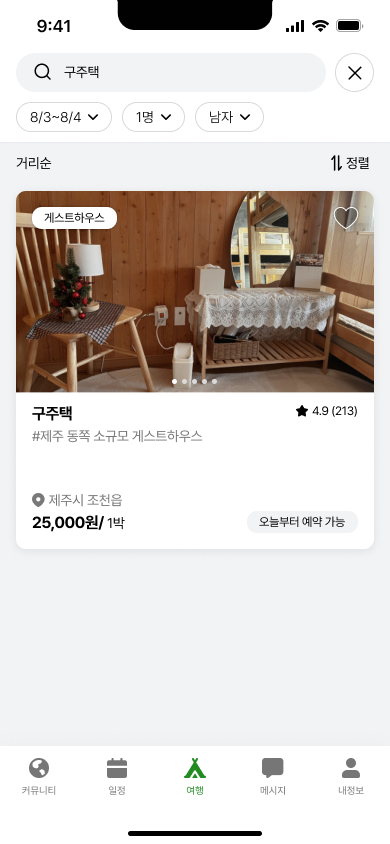<br><sub><b>검색 결과</b></sub></td>
<td align="center" width="25%"><br><sub><b>날짜 선택</b></sub></td>
</tr>
<tr>
<td align="center">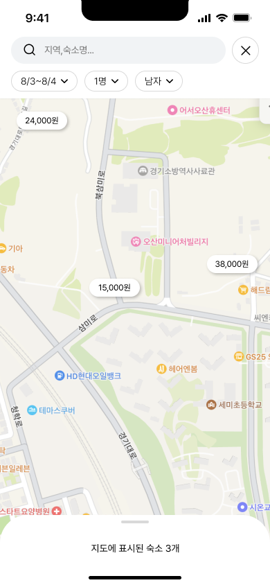<br><sub><b>지도</b><br>타일 기반 로딩</sub></td>
<td align="center">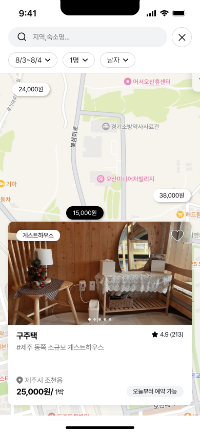<br><sub><b>마커 선택</b></sub></td>
<td align="center">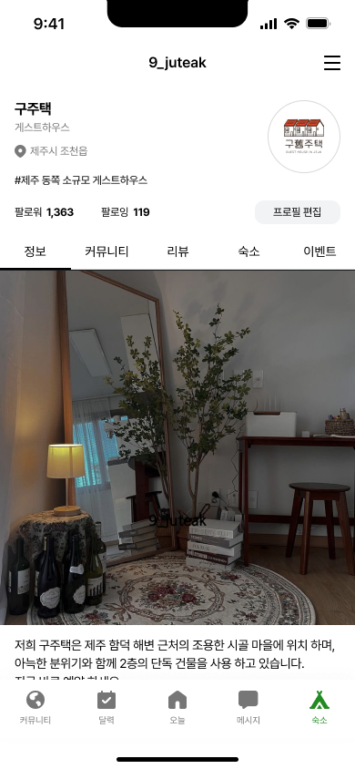<br><sub><b>숙소 상세</b></sub></td>
<td align="center">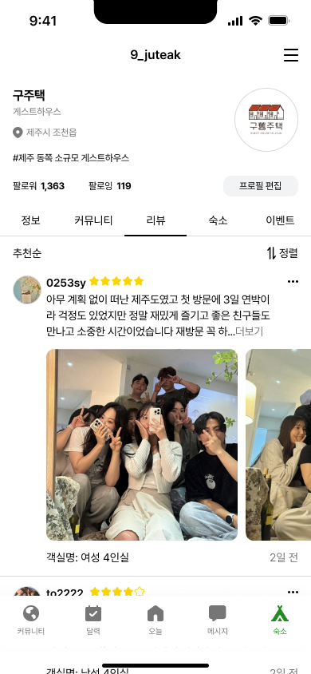<br><sub><b>리뷰</b></sub></td>
</tr>
</table>
</details>

<details>
<summary><b>🧾 &nbsp;예약</b> &nbsp;— &nbsp;객실 · 날짜 · 인원 · 결제</summary>
<br>
<table>
<tr>
<td align="center" width="25%">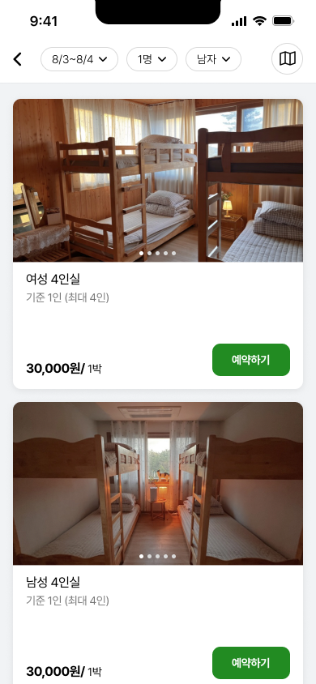<br><sub><b>객실 선택</b></sub></td>
<td align="center" width="25%">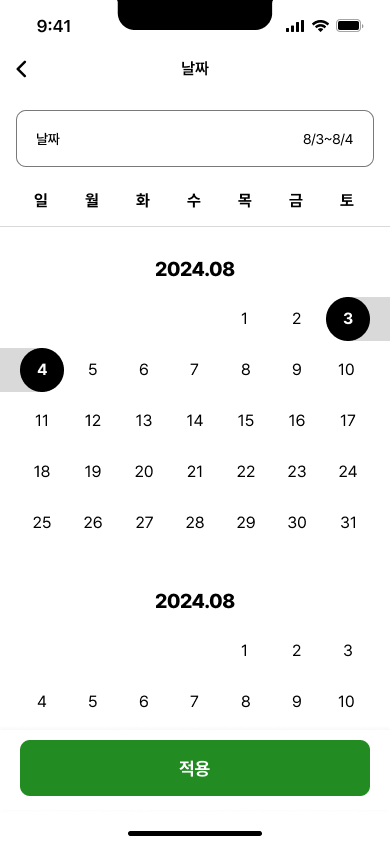<br><sub><b>날짜</b></sub></td>
<td align="center" width="25%">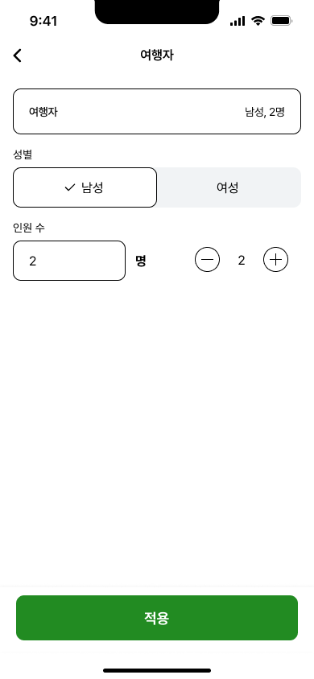<br><sub><b>인원 · 성별</b></sub></td>
<td align="center" width="25%">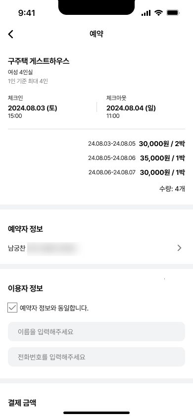<br><sub><b>예약 확인</b><br>이용자 정보 · 결제 금액</sub></td>
</tr>
</table>
</details>

<details>
<summary><b>🧭 &nbsp;동행 · 커뮤니티</b> &nbsp;— &nbsp;모집 · 신청 · 글쓰기 · 태그 · 정렬</summary>
<br>
<table>
<tr>
<td align="center" width="25%">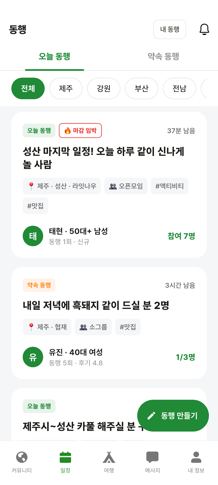<br><sub><b>오늘 동행</b><br>마감 임박 · 남은 시간</sub></td>
<td align="center" width="25%">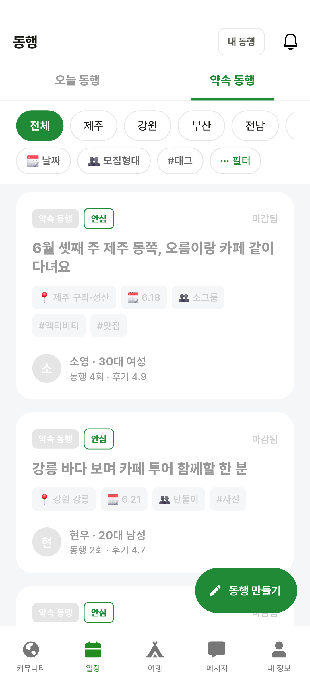<br><sub><b>약속 동행</b><br>날짜 · 모집 형태 필터</sub></td>
<td align="center" width="25%">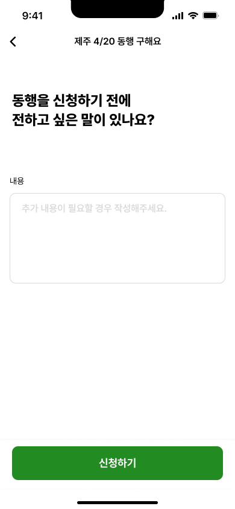<br><sub><b>동행 신청</b></sub></td>
<td align="center" width="25%">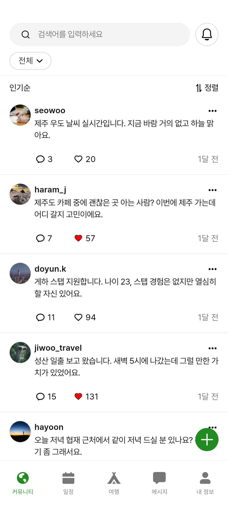<br><sub><b>커뮤니티 피드</b></sub></td>
</tr>
<tr>
<td align="center">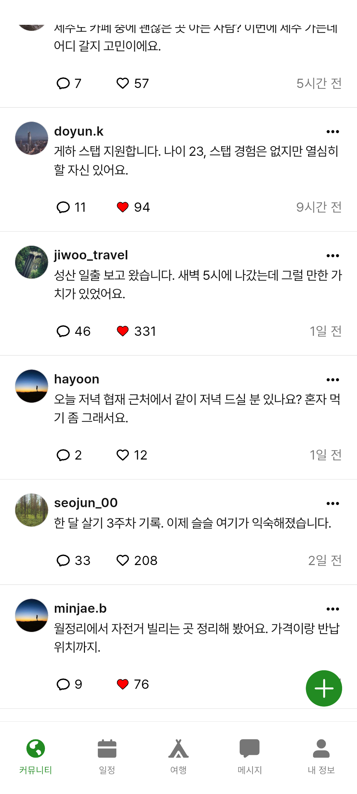<br><sub><b>피드 스크롤</b></sub></td>
<td align="center">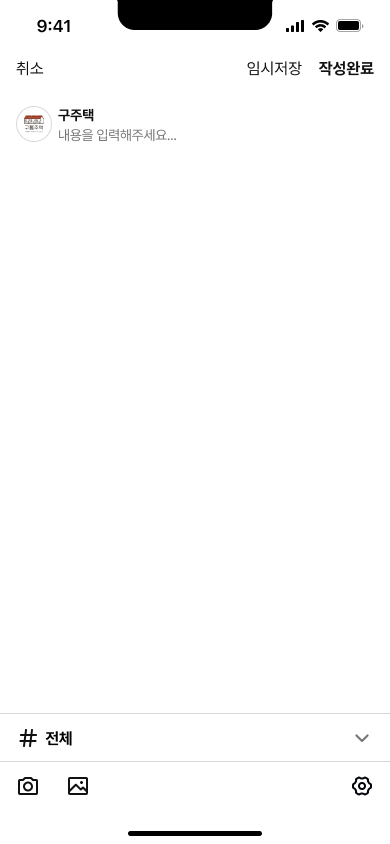<br><sub><b>글쓰기</b><br>임시저장 · 사진</sub></td>
<td align="center">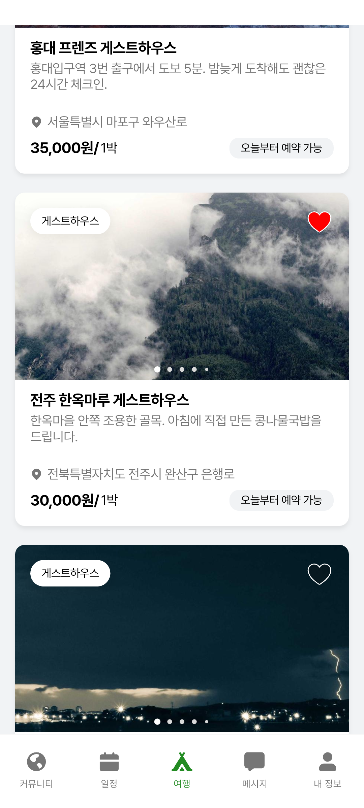<br><sub><b>숙소 목록 스크롤</b></sub></td>
<td align="center">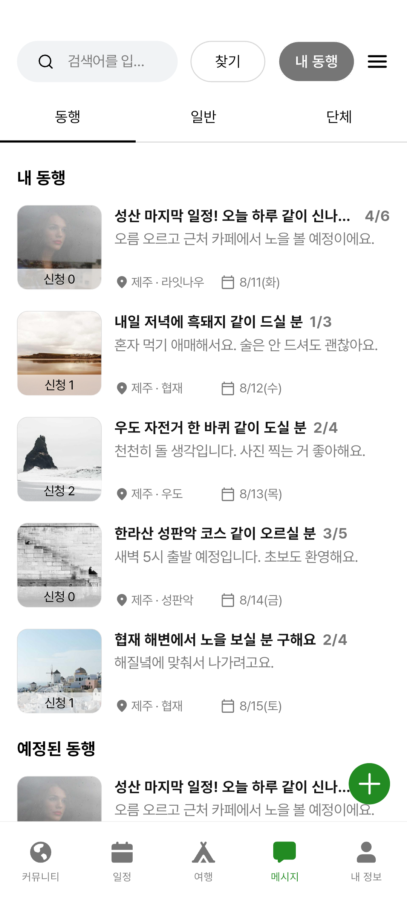<br><sub><b>내 동행</b><br>신청 수 · 참여 인원</sub></td>
</tr>
<tr>
<td align="center">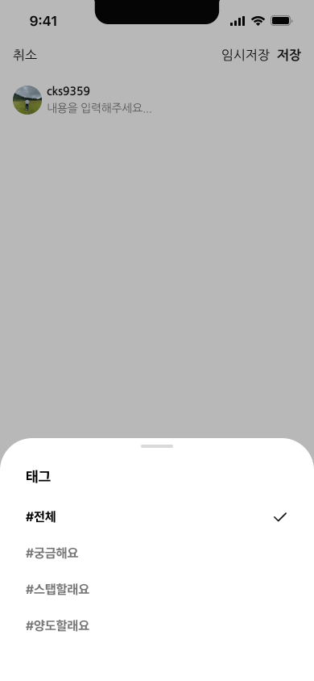<br><sub><b>태그</b></sub></td>
<td align="center">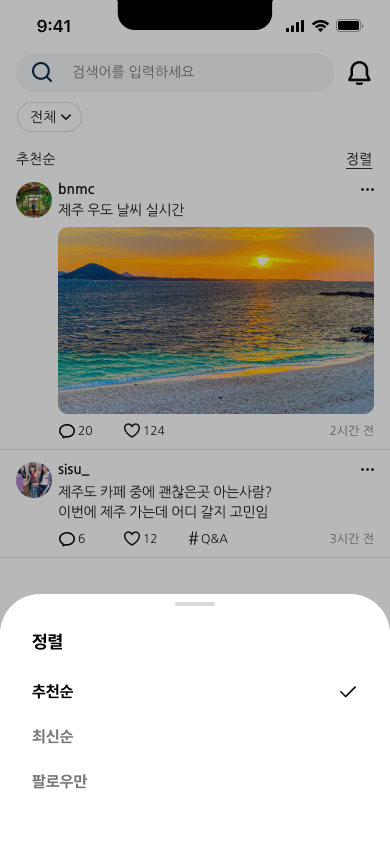<br><sub><b>정렬</b></sub></td>
<td align="center">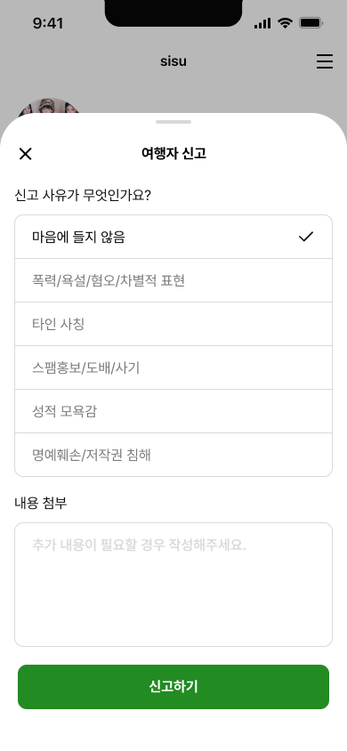<br><sub><b>신고</b><br>사유 선택 · 내용 첨부</sub></td>
<td align="center">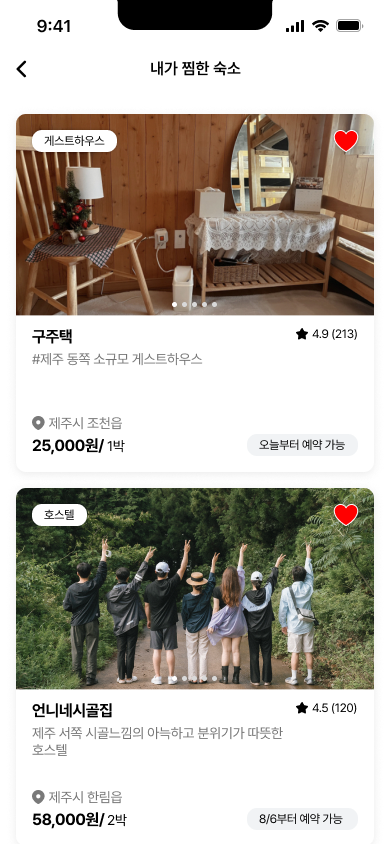<br><sub><b>찜한 숙소</b></sub></td>
</tr>
</table>
</details>

<details>
<summary><b>💬 &nbsp;메시지 · 일정</b> &nbsp;— &nbsp;1:1 · 단체 · 동행 채팅 · 일정 추가</summary>
<br>
<table>
<tr>
<td align="center" width="25%"><br><sub><b>메시지 목록</b><br>일반 · 단체 · 동행</sub></td>
<td align="center" width="25%">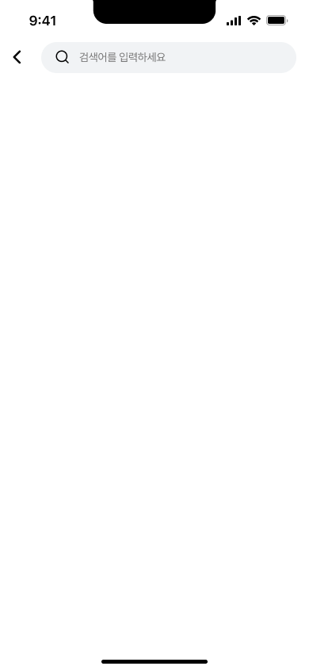<br><sub><b>대화 검색</b></sub></td>
<td align="center" width="25%"><br><sub><b>일정</b></sub></td>
<td align="center" width="25%">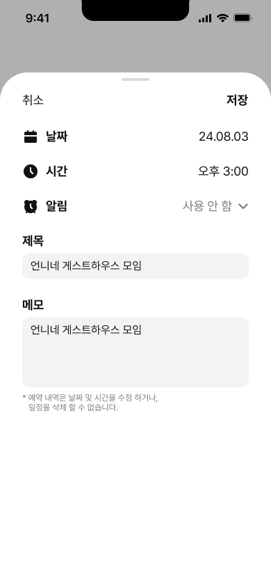<br><sub><b>일정 추가</b><br>날짜 · 시간 · 알림</sub></td>
</tr>
<tr>
<td align="center">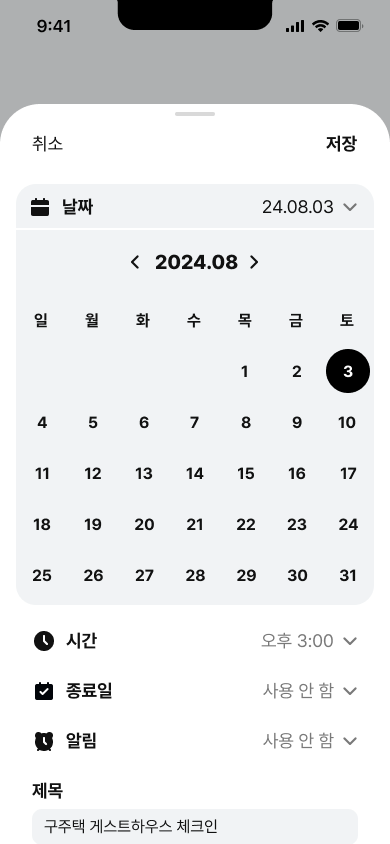<br><sub><b>일정 날짜</b></sub></td>
<td align="center" colspan="3">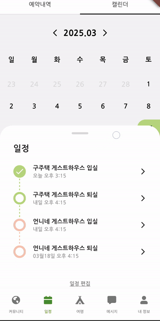<br><sub><b>호스트 예약 달력</b> &nbsp;— &nbsp;월 이동 · 입·퇴실 일정 · 기간 하이라이트</sub></td>
</tr>
</table>
</details>

<details>
<summary><b>🔑 &nbsp;계정 · 호스트</b> &nbsp;— &nbsp;소셜 4종 · 휴대폰 인증 · 숙소 관리</summary>
<br>
<table>
<tr>
<td align="center" width="25%">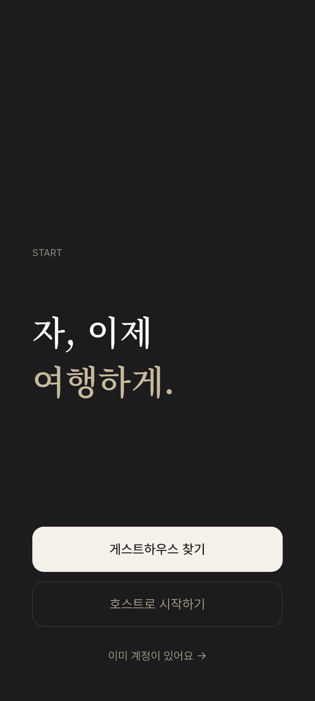<br><sub><b>시작</b><br>게스트 · 호스트 갈림길</sub></td>
<td align="center" width="25%">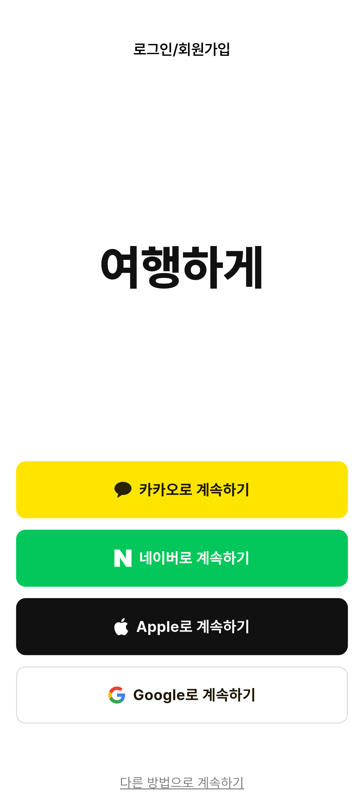<br><sub><b>로그인</b><br>카카오 · 네이버 · 구글 · 애플</sub></td>
<td align="center" width="25%">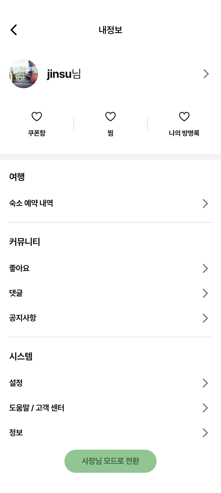<br><sub><b>내 정보</b><br>쿠폰 · 찜 · 방명록 · 설정</sub></td>
<td align="center" width="25%">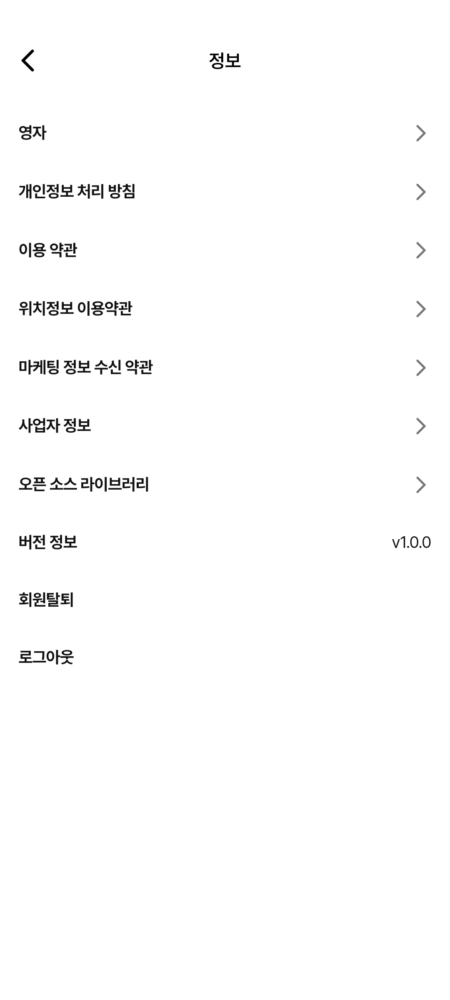<br><sub><b>정보</b><br>약관 · 오픈소스 · 버전</sub></td>
</tr>
<tr>
<td align="center">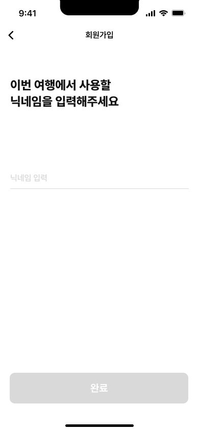<br><sub><b>회원가입</b><br>인증 · 약관 · 닉네임</sub></td>
<td align="center">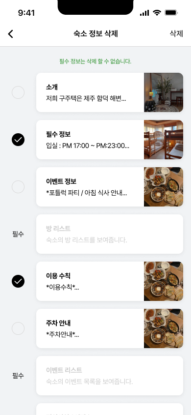<br><sub><b>숙소 정보 관리</b></sub></td>
<td align="center" colspan="2"><sub>호스트 콘솔은 파일만 89개라 일부만 실었습니다. 숙소 등록 마법사와 정산 화면은 <a href="#호스트가-된다">위쪽 GIF</a>에서 볼 수 있습니다.</sub></td>
</tr>
<tr>
<td align="center">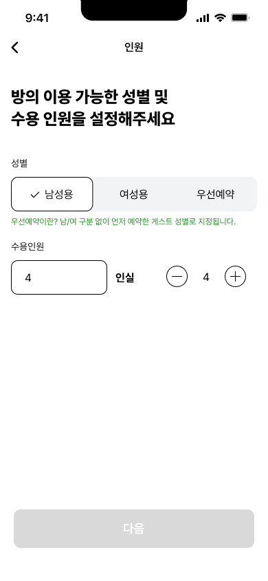<br><sub><b>객실 설정</b><br>이용 가능 성별 · 수용 인원</sub></td>
<td align="center" colspan="3"><sub>호스트 콘솔은 파일만 89개라 일부만 실었습니다. 숙소 등록 마법사와 정산 화면은 <a href="#호스트가-된다">위쪽 GIF</a>에서 볼 수 있습니다.</sub></td>
</tr>
</table>
</details>

---

## 만들면서 부딪힌 것들

각 문제는 **증상에서 시작합니다.** 코드를 보고 발견한 게 아니라, 누군가 "이거 이상한데요"라고 말해서 알게 된 것들입니다.

<table>
<tr><th width="26%">증상</th><th width="30%">진짜 원인</th><th>해결</th></tr>
<tr>
<td>지도를 한 번 쓸면 요청이 수십 번 나간다</td>
<td>화면 경계가 <b>연속적인 실수 값</b>이라 캐시 키가 될 수 없었다</td>
<td>고정 격자로 <b>정수 타일 ID</b> 부여 · 디바운스 · 유사 영역 판정 · 30분 캐시<br>→ <a href="docs/02-map-tiling.md">자세히</a></td>
</tr>
<tr>
<td>며칠 만에 앱을 켜면 가끔 로그아웃된다</td>
<td>동시에 뜬 요청 여섯 개가 <b>각자 토큰 갱신</b>을 시도해 1회용 리프레시 토큰이 서로를 무효화</td>
<td>갱신을 <b>공유되는 Future</b>로 만들어 요청이 한 번만 나가게<br>→ <a href="docs/04-api-client.md">자세히</a></td>
</tr>
<tr>
<td>수락한 예약이 다른 화면에선 계속 대기 중</td>
<td>전역 변수는 값이 바뀌어도 <b>리빌드를 유발하지 않는다</b></td>
<td>목록이 아니라 <b>"다시 불러와야 한다"는 신호</b>만 공유<br>→ <a href="docs/03-state-management.md">자세히</a></td>
</tr>
<tr>
<td>사진 올리다 앱을 나가면 처음부터 다시</td>
<td>업로드가 <b>앱 생명주기에 묶여</b> 있었다</td>
<td>포그라운드 태스크로 분리 · <b>큐를 디스크에 저장</b>해 강제 종료 후에도 이어서<br>→ <a href="docs/06-background-upload.md">자세히</a></td>
</tr>
<tr>
<td>같은 품질로 압축했는데 어떤 사진은 흐리고 어떤 사진은 용량 초과</td>
<td>사진마다 복잡도가 달라 <b>고정 품질은 답이 될 수 없었다</b></td>
<td>품질 20~95 구간을 <b>이분 탐색</b>해 목표 용량을 넘지 않는 최고 품질을 사진마다 결정 · 최대 7회<br>→ <a href="docs/06-background-upload.md#04--올리기-전에-줄이기">자세히</a></td>
</tr>
<tr>
<td>지하철에서 보낸 메시지가 사라진다</td>
<td>연결이 끊겼는데 소켓은 <b>연결됨으로 표시</b>돼 있었다</td>
<td>25초 하트비트로 죽은 연결 감지 · 메시지를 로컬 DB에 저장<br>→ <a href="docs/05-realtime-message.md">자세히</a></td>
</tr>
<tr>
<td>걸으면서 쓰면 버튼이 자꾸 빗나간다</td>
<td>디자이너가 준 <b>24dp가 그대로 터치 영역</b>이 됐다</td>
<td>보이는 크기는 두고 <b>투명 여백으로 48dp</b>까지 확장<br>→ <a href="docs/08-ux-details.md">자세히</a></td>
</tr>
</table>

<br>

### 그중 지도 이야기

여섯 개 중 가장 오래 붙잡고 있었던 건 첫 번째, 지도였습니다. 나머지는 원인을 찾으면 고칠 방법이 비교적 분명했는데, 지도는 "**무엇을 캐시의 단위로 삼을 것인가**"부터 정해야 했기 때문입니다.

화면 경계는 연속적인 실수라 그대로는 캐시 키가 되지 못합니다. 그래서 한반도에 고정 격자를 깔고 좌표를 **정수 번호**로 바꿨습니다. 그러고 나니 "이미 받아온 영역인가"가 집합 연산 한 번으로 풀렸습니다.

만들면서 이게 제대로 도는지 눈으로 봐야 했는데, 격자는 눈에 보이지 않는 개념이라 확인할 방법이 없었습니다. 그래서 **격자와 타일 번호를 화면에 직접 그려 놓고** 개발했습니다.

<div align="center">
<br>
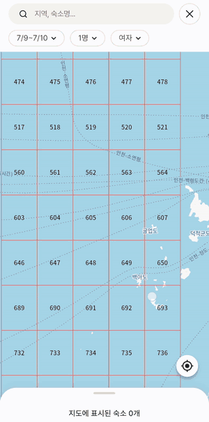<br>
<sub>격자와 타일 번호를 화면에 직접 그려 검증하던 개발용 화면 · 실제 앱에는 나오지 않습니다</sub>
<br><br>
</div>

<br>

지도를 움직이면 화면에 걸치는 타일 번호가 바뀌고, 그중 **캐시에 없는 것만** 서버로 나갑니다. 하단의 "지도에 표시된 숙소 N개"는 타일 단위로 받아온 데이터 중 **실제 화면 다각형 안에 들어오는 것만** 센 값입니다. 요청은 넓게, 렌더링은 좁게.

손가락을 뗀 뒤 요청이 서버까지 가려면 관문 셋을 지나야 합니다.

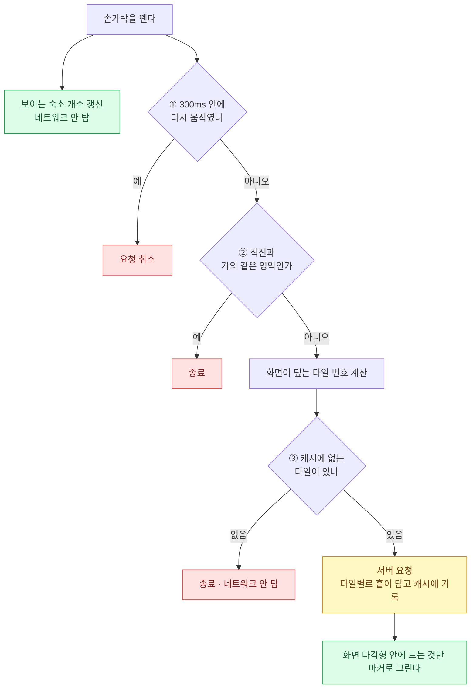
```mermaid
flowchart TD
    T["손가락을 뗀다"] --> V["보이는 숙소 개수 갱신<br/>네트워크 안 탐"]
    T --> D1{"① 300ms 안에<br/>다시 움직였나"}
    D1 -->|예| X1["요청 취소"]
    D1 -->|아니오| D2{"② 직전과<br/>거의 같은 영역인가"}
    D2 -->|예| X2["종료"]
    D2 -->|아니오| CALC["화면이 덮는 타일 번호 계산"]
    CALC --> D3{"③ 캐시에 없는<br/>타일이 있나"}
    D3 -->|없음| X3["종료 · 네트워크 안 탐"]
    D3 -->|있음| REQ["서버 요청<br/>타일별로 흩어 담고 캐시에 기록"]
    REQ --> DRAW["화면 다각형 안에 드는 것만 마커로 그린다"]

    style X1 fill:#fee2e2,stroke:#ef4444,color:#7f1d1d
    style X2 fill:#fee2e2,stroke:#ef4444,color:#7f1d1d
    style X3 fill:#fee2e2,stroke:#ef4444,color:#7f1d1d
    style REQ fill:#fef9c3,stroke:#ca8a04,color:#713f12
    style DRAW fill:#dcfce7,stroke:#16a34a,color:#14532d
    style V fill:#dcfce7,stroke:#16a34a,color:#14532d
```

붉은 종료 지점 셋이 이 구조의 핵심입니다. **가장 빠른 요청은 나가지 않는 요청**입니다.

### 직접 재본 결과

말로만 하면 믿기 어려우니 직접 측정했습니다. **지도를 16번 드래그**하며 로그를 수집했습니다.

<div align="center">

| | |
|:--|--:|
| 드래그 후 로드 시도 | **16회** |
| 그중 서버 호출이 나간 횟수 | **1회** |
| 캐시로 해결된 횟수 | **15회** |
| 화면이 덮은 타일 (누적) | **64개** |
| 그중 캐시 적중 | **61개** |
| 실제 서버에 요청한 타일 | **3개** |

**캐시 적중률 95.3%** &nbsp;·&nbsp; **로드 시도 대비 서버 호출 6.3%**

</div>

같은 지역을 오가는 조작이라 적중률이 높게 나온 면이 있습니다. 다만 지도를 쓰는 실제 행동이 대개 한 지역을 들여다보며 왔다 갔다 하는 것이라, **이 패턴에서 잘 듣는다는 것 자체가 설계 의도**와 맞습니다. 측정 조건은 [문서](docs/02-map-tiling.md#05--실제로-얼마나-줄었나)에 그대로 적어 뒀습니다.

---

## 앱의 뼈대

화면 150여 개가 서로를 어떻게 붙들고 있는지의 이야기입니다.

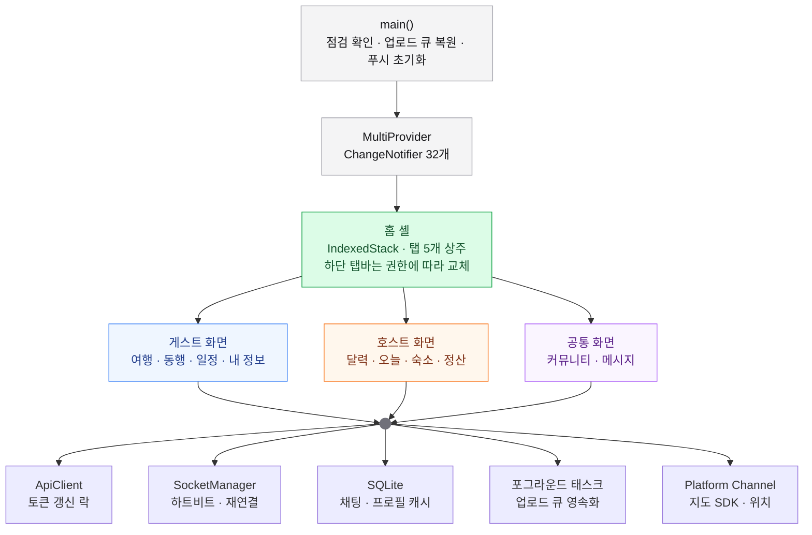
```mermaid
flowchart TD
    A["main()<br/>점검 확인 · 업로드 큐 복원 · 푸시 초기화"]
    B["MultiProvider<br/>ChangeNotifier 32개"]
    C["홈 셸<br/>IndexedStack · 탭 5개 상주<br/>하단 탭바는 권한에 따라 교체"]

    A --> B --> C

    C --> G["게스트 화면<br/>여행 · 동행 · 일정 · 내 정보"]
    C --> H["호스트 화면<br/>달력 · 오늘 · 숙소 · 정산"]
    C --> S["공통 화면<br/>커뮤니티 · 메시지"]

    G --> L(( ))
    H --> L
    S --> L

    L --> N1["ApiClient<br/>토큰 갱신 락"]
    L --> N2["SocketManager<br/>하트비트 · 재연결"]
    L --> N3["SQLite<br/>채팅 · 프로필 캐시"]
    L --> N4["포그라운드 태스크<br/>업로드 큐 영속화"]
    L --> N5["Platform Channel<br/>지도 SDK · 위치"]

    style A fill:#f4f4f5,stroke:#a1a1aa,color:#18181b
    style B fill:#f4f4f5,stroke:#a1a1aa,color:#18181b
    style C fill:#dcfce7,stroke:#16a34a,color:#14532d
    style G fill:#eff6ff,stroke:#3b82f6,color:#1e3a8a
    style H fill:#fff7ed,stroke:#f97316,color:#7c2d12
    style S fill:#faf5ff,stroke:#a855f7,color:#581c87
    style L fill:#71717a,stroke:#71717a,color:#71717a
```

세 가지가 이 뼈대를 지탱합니다.

**탭 다섯 개가 항상 살아 있습니다.** `IndexedStack`이라 탭을 옮겨도 화면이 버려지지 않습니다. 커뮤니티 피드를 한참 내리다 메시지를 확인하고 돌아왔을 때 그 자리에 그대로 있는 것이, 이 앱에서는 메모리보다 중요했습니다.

**권한이 바뀌면 탭이 통째로 교체됩니다.** 게스트와 호스트는 사실상 다른 앱이라, 화면 안에서 `if (isHost)`로 나누지 않고 셸 수준에서 갈랐습니다. 조건문으로 시작하면 그게 모든 화면으로 번집니다.

**화면은 서로를 직접 부르지 않습니다.** 예약을 수락한 화면이 달력 화면을 직접 갱신하지 않고, 가운데 상태 계층에 "바뀌었다"고만 알립니다. 화면이 150개가 넘는 앱에서 화면끼리 직접 얽히기 시작하면 어디서 무엇이 바뀌는지 추적이 불가능해집니다. → [상태 관리](docs/03-state-management.md)

<details>
<summary>시작 순서 자세히 보기</summary>
<br>

```
main()
 ├─ 스플래시 유지 (로그인 확인이 끝날 때까지)
 ├─ 서버 점검 확인 → 점검 중이면 여기서 멈춤
 ├─ 저장된 업로드 큐 복원 → 중단된 업로드 이어서
 ├─ 푸시 · 알림 초기화
 └─ MultiProvider (ChangeNotifier 32개)
      └─ 로그인 여부 분기
           ├─ 온보딩 / 로그인
           └─ 홈 셸
                ├─ IndexedStack ······ 탭 5개를 모두 살려 둠
                ├─ 하단 탭바 ········· 권한에 따라 게스트/호스트 교체
                └─ SocketManager ····· 하트비트 · 재연결 · 로컬 DB 동기화
```

**탭을 `IndexedStack`으로 쌓아 둡니다.** 매번 새로 만들면 스크롤 위치와 입력 중이던 내용이 날아갑니다. 커뮤니티 피드를 한참 내리다 메시지를 확인하고 돌아왔을 때 그 자리에 그대로 있는 것이, 이 앱에서는 메모리보다 중요했습니다.

**점검 확인을 첫 프레임 전에 합니다.** 서버가 내려갔는데 앱이 정상적으로 열리면 사용자는 화면마다 다른 에러를 봅니다. 다만 네트워크 자체가 끊긴 경우는 점검으로 취급하지 않습니다. 지하철에서 앱을 켰다고 "서버 점검 중"이라고 하면 안 되니까요.

</details>

---

## 깊이 들어간 이야기

| | |
|---|---|
| **[아키텍처](docs/01-architecture.md)** | 왜 Flutter였나 · 렌더링 3단 구조 · Platform Channel의 진짜 비용 |
| **[지도 타일링](docs/02-map-tiling.md)** | 격자 상수를 역산한 이유 · 세 겹의 방어선 · 넓게 받고 좁게 그리기 |
| **[상태 관리](docs/03-state-management.md)** | 전역 변수가 못 하는 한 가지 · 값을 공유할지 신호를 공유할지 |
| **[API 클라이언트](docs/04-api-client.md)** | 갱신을 함수가 아닌 Future로 · REST와 소켓이 락을 공유하는 법 |
| **[실시간 메시지](docs/05-realtime-message.md)** | 연결됨을 믿지 않기 · 오프라인에서도 열리는 채팅방 |
| **[백그라운드 업로드](docs/06-background-upload.md)** | 앱이 살아 있다고 전제하지 않기 · 큐를 디스크에 두는 이유 |
| **[디자인 시스템](docs/07-design-system.md)** | 시안 390×779를 모든 기기에 · 글자만 환산하지 않은 이유 |
| **[UX 디테일](docs/08-ux-details.md)** | 에러 로그에 안 잡히는 버그들 · 애니메이션의 적정 구간 |

코드 발췌는 [`src/`](src)에 있습니다. 단독으로 빌드되지 않는 조각이며, 시크릿과 디버그 로그를 걷어냈습니다.

---

## 숫자로 보는 19개월

<div align="center">

| | | | |
|---|---|---|---|
| **250** | **158,560** | **268** | **32** |
| Dart 파일 | 코드 라인 | 위젯 클래스 | ChangeNotifier |
| **101** | **5** | **271** | **128** |
| REST 엔드포인트 | 로컬 DB 테이블 | 커밋 | 병합된 PR |

</div>

`Scaffold`를 가진 파일이 147개, 호스트 콘솔(`Manager` · `Lodging`)만 89개 파일입니다. 가장 큰 덩어리가 호스트 쪽이고, 그다음이 프로필 · 여행 · 메시지 · 예약 달력 순입니다.

---

## 무엇으로 만들었나

| | |
|---|---|
| **화면** | Flutter · Dart |
| **상태** | Provider (ChangeNotifier) |
| **통신** | http · Dio (멀티파트) · Socket.IO |
| **저장** | SQLite · SharedPreferences · 이미지 캐시 |
| **지도 · 위치** | Kakao Map SDK · Google Maps · Geolocator |
| **인증** | Firebase Auth · 카카오 · 네이버 · 구글 · 애플 |
| **결제** | Toss Payments 결제위젯 v2 (WebView) |
| **문자 인증** | Solapi (휴대폰 번호 인증) |
| **미디어** | 이미지 압축 · 에셋 피커 · 직접 포크한 뷰어/크로퍼 |
| **알림 · 백그라운드** | FCM · 로컬 알림 · 포그라운드 태스크 |

### 없어서 직접 만든 것

필요한 동작이 원본 라이브러리에 없어서 포크해 고쳐 쓴 것들입니다.

**[Flutter_Photoview_Custom](https://github.com/kiwijuse/Flutter_Photoview_Custom)** — 사진을 아래로 쓸어내려 닫는 제스처를 넣으려는데, 원본에는 **확대/축소가 끝나는 시점을 알려주는 콜백이 없었습니다.** 그게 없으면 "지금 사용자가 확대 중인지, 닫으려고 내리는 중인지"를 구분할 수 없습니다. 제스처 종료 콜백을 위젯 · 갤러리 · 코어까지 연결해 넣는 게 수정의 핵심이었습니다. 더불어 더블탭 확대와 갤러리 페이징 버그도 함께 고쳤습니다.

**[flutter_image_cropper_custom](https://github.com/kiwijuse/flutter_image_cropper_custom)** — 크롭 화면에서 상태바 아이콘이 어두운 배경에 묻혀 보이지 않던 문제를 고쳤습니다.

---

## 다시 만든다면

숨기면 회고가 아니라서 적습니다.

**공통 컴포넌트를 먼저 뽑을 것입니다.** 버튼 · 앱바 · 바텀시트를 화면마다 다시 선언했습니다. 초반엔 빨랐지만 화면이 100개를 넘어가면서 디자인이 한 번 바뀔 때마다 수십 곳을 고쳐야 했습니다. 호스트 이벤트 등록 화면 네 개는 서로 거의 같은 코드가 각각 1,300줄씩 들어 있습니다. **16만 줄이라는 숫자는 규모의 증거가 아니라 이 부채의 크기입니다.** 화면 열 개쯤 만든 시점이 가장 싸고, 그 이후로는 계속 비싸집니다.

**색과 간격을 한곳에 모을 것입니다.** 브랜드 초록색을 쓸 때마다 `Color(0xFF228B22)`를 직접 적었습니다. 상수 하나로 두지 않았으니, 색을 조금만 바꾸려 해도 전체 검색으로 찾아 하나씩 고쳐야 합니다. 여백과 글자 크기도 화면마다 그때그때 정했습니다. 큰 사고가 나지는 않았지만, **"이 앱의 초록색은 무엇이다"라고 한 곳을 가리킬 수 없는 상태**가 됐습니다. → [디자인 시스템](docs/07-design-system.md)

**접근성을 처음부터 넣을 것입니다.** 시각장애인은 화면을 눈으로 보는 대신 **소리로 듣습니다.** 안드로이드의 TalkBack 같은 기능이 화면 위 요소를 하나씩 읽어 주는데, 이때 읽을 내용을 개발자가 붙여 줘야 합니다.

우리 앱은 하트 · 뒤로가기 · 더보기처럼 **글자 없이 아이콘만 있는 버튼**이 많습니다. 여기에 설명을 붙이지 않아서, 화면을 소리로 듣는 사람에게는 대부분이 그냥 "버튼"으로만 읽히거나 아예 건너뛰어집니다. 무엇을 누르는 건지 알 수 없으니 앱을 쓸 수가 없습니다.

붙이는 일 자체는 어렵지 않습니다. 위젯 하나를 감싸고 설명 한 줄을 적으면 됩니다. 하지만 **화면을 만들 때 그 사용자를 떠올리지 않으면 영원히 안 하게 됩니다.** 나중에 200곳을 찾아다니는 것보다 처음에 한 줄씩 적는 게 훨씬 쌉니다.

**테스트를 쓸 것입니다.** 이 프로젝트에는 코드가 제대로 도는지 자동으로 확인해 주는 장치가 없습니다.

무엇이 문제냐면, **한 곳을 고쳤을 때 다른 곳이 망가졌는지 알 방법이 없다**는 것입니다. 예를 들어 예약 취소 로직을 손보면 예약 내역 화면만 영향받는 게 아닙니다. 호스트의 예약 달력, 게스트의 일정 탭, 알림, 정산 금액이 전부 같은 데이터를 봅니다. 제대로 확인하려면 그 화면들을 직접 눌러 봐야 합니다.

화면이 150개가 넘으니 매번 그럴 수는 없습니다. 결국 "이 정도면 됐겠지" 하고 넘어가고, 문제는 엉뚱한 화면에서 나중에 드러납니다. 테스트가 있으면 이 확인을 명령 한 번으로 끝낼 수 있습니다. 당시에는 화면을 하나라도 더 만드는 쪽을 택했는데, **화면이 늘어날수록 손으로 확인해야 할 양도 같이 늘어난다**는 걸 나중에 체감했습니다.

---

## 더 읽을거리

이 프로젝트를 하며 부딪힌 문제를 정리해 둔 글입니다.

| | |
|---|---|
| [상태 관리가 필요했던 순간: 변수에서 Provider로](https://yeohaenghage.kr/frontend/flutter_provider) | 화면 간 상태가 어긋나는 문제와 해결 |
| [지도를 '그리지 않음'으로써 가장 빠른 지도를 그리는 법](https://yeohaenghage.kr/frontend/map_tiling) | 격자 설계 · 캐시 · 요청 억제 |
| [모바일 앱 UI/UX 설계 가이드](https://yeohaenghage.kr/frontend/ux_navigation) | 인지 부하 · 체감 성능 · 터치 영역 |
| [Flutter 아키텍처 딥다이브](https://yeohaenghage.kr/frontend/flutter_architecture) | 렌더링 구조 · Platform Channel · 백그라운드 |

위 글들은 팀 기술 블로그 [yeohaenghage.kr](https://yeohaenghage.kr/)에 있습니다. 프론트엔드 외에 백엔드 · 인프라 · 디자인 · 브랜딩 글도 함께 올려 두었습니다. 서버 쪽 회고는 [align-retrospective](https://github.com/pill27211/align-retrospective)에 따로 있습니다.

---

## 만든 사람들

| | |
|---|---|
| **이진수** [@kiwijuse](https://github.com/kiwijuse) | **프론트엔드** — 앱 전 화면 구현 · 클라이언트 아키텍처 · API 연동 |
| **남궁찬** | 기획 · 디자인 · 마케팅 (팀 대표) |
| [@pill27211](https://github.com/pill27211) | 백엔드 · 인프라 |
| [@Namhunk](https://github.com/Namhunk) | QA |

사업자 등록과 법적 절차를 마치고 앱 출시 단계까지 갔지만, 실서비스 직전에 마무리되지 못했습니다. 그래도 19개월 동안 화면 150여 개를 실제로 굴러가게 만들어 본 경험이 남았습니다.

<br>

<div align="center">
<sub>상용 · 팀 프로젝트의 프론트엔드 회고이며, 서비스 소스 전체를 포함하지 않습니다.</sub>
</div>

<br>

---
