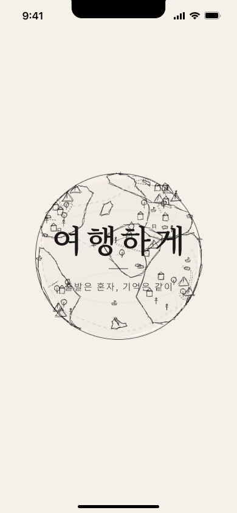

<div align="center">


# 여행하게

### 출발은 혼자, 기억은 같이

혼자 떠나는 사람들이 **여행 동행**을 만나고,<br>
**혼여행자를 위한 게스트하우스**에 머무는 플랫폼.


**팀 프로젝트** &nbsp;·&nbsp; **2024.11 → 2026.06** &nbsp;·&nbsp; 개발 2명 + 디자이너 1명 &nbsp;·&nbsp; [yeohaenghage.com](https://yeohaenghage.com)


</div>

<br>

> [!NOTE]
> 이 저장소는 **프론트엔드 관점의 회고**입니다.
> 상용·팀 프로젝트라 서비스 전체 소스는 담지 않았고, 설계 의도가 드러나는 부분만 시크릿을 제거한 발췌본으로 옮겼습니다.
> 백엔드·인프라 회고는 [pill27211/align-retrospective](https://github.com/pill27211/align-retrospective)에 따로 있습니다.

---

## 문서

| | |
|---|---|
| **[아키텍처](docs/01-architecture.md)** | 왜 Flutter였나 · 렌더링 3단 구조 · Platform Channel의 비용 |
| **[지도 타일링](docs/02-map-tiling.md)** | 지도를 드래그해도 서버를 때리지 않는 법 |
| **[상태 관리](docs/03-state-management.md)** | 전역 변수가 못 하는 한 가지 · Consumer로 리빌드 범위 좁히기 |
| **[API 클라이언트](docs/04-api-client.md)** | 토큰 갱신이 동시에 여섯 번 나갔던 이야기 |
| **[실시간 메시지](docs/05-realtime-message.md)** | 소켓이 죽은 걸 모르는 소켓 · 오프라인에서도 열리는 채팅방 |
| **[백그라운드 업로드](docs/06-background-upload.md)** | 앱을 꺼도 사진 10장이 올라가게 만들기 |
| **[디자인 시스템](docs/07-design-system.md)** | 시안 390×779를 모든 기기에 맞추기 |
| **[UX 디테일](docs/08-ux-details.md)** | 에러 로그에 안 잡히는 버그들 |

---

## 어떤 서비스인가

혼자 여행을 떠나는 사람은 계속 늘어나는데, 정작 **현지에서 누군가와 함께하고 싶어질 때 방법이 없다**는 데서 출발했습니다.

여행하게는 두 축으로 그 문제를 풉니다.

- **동행** — 오늘 갈 동행을 찾거나 직접 만들고, 신청·수락을 거쳐 자동으로 만들어진 그룹 채팅에서 모입니다. 처음 만나는 사이인 만큼 후기 시스템 · 신청 수락제 · 최소 정보 원칙을 함께 뒀습니다.
- **숙소** — 직접 검증한 게스트하우스만 올립니다. 숙소를 고르기 전에 공간과 호스트를 먼저 보여주는 쪽으로 설계했습니다.

<div align="center">
<br>
<sub>첫 실행 화면 · 요소를 한꺼번에 띄우지 않고 시차를 두어 읽는 순서를 만들었습니다</sub>
</div>

설명이 필요한 서비스라 **첫 화면에서 개념이 전달되지 않으면 사용자는 그냥 나갑니다.** 그래서 온보딩에 쓴 애니메이션은 장식이 아니라 문장을 순서대로 읽히게 하려는 장치였습니다. → [UX 디테일](docs/08-ux-details.md#06--온보딩)

게스트가 쓰는 앱과 호스트가 쓰는 앱이 **한 바이너리 안에 같이 들어 있습니다.** 계정 권한에 따라 하단 탭 다섯 개가 통째로 바뀝니다.

<div align="center">

| | 게스트 모드 | 호스트 모드 |
|---|---|---|
| 탭 구성 | 커뮤니티 · 일정 · 여행 · 메시지 · 내 정보 | 커뮤니티 · 달력 · 오늘 · 메시지 · 숙소 |
| 하는 일 | 숙소 탐색 · 예약 · 동행 매칭 | 객실/이벤트 등록 · 예약 승인 · 정산 |

</div>

> [!NOTE]
> 표의 탭 구성은 **마지막으로 빌드된 코드 기준**입니다. 아래 화면 이미지는 디자인 원본에서 가져왔는데, 여기서는 `일정` 자리에 `동행`이 들어간 이후 버전이라 서로 다르게 보입니다. 동행을 별도 탭으로 끌어올리는 개편이 진행 중이었고, 코드에 반영되기 전에 프로젝트가 멈췄습니다.

---

## 화면

<div align="center">
<table>
<tr>
<td align="center" width="25%"><br><sub><b>인트로</b><br>브랜드 · 로그인 진입</sub></td>
<td align="center" width="25%"><br><sub><b>숙소 목록</b><br>거리순 · 필터 · 찜</sub></td>
<td align="center" width="25%"><br><sub><b>지도 탐색</b><br>타일 기반 숙소 로딩</sub></td>
<td align="center" width="25%"><br><sub><b>숙소 상세</b><br>정보 · 커뮤니티 · 리뷰</sub></td>
</tr>
<tr>
<td align="center"><br><sub><b>객실 · 예약</b><br>날짜 · 인원 · 결제</sub></td>
<td align="center"><br><sub><b>동행</b><br>오늘 동행 · 약속 동행</sub></td>
<td align="center"><br><sub><b>커뮤니티</b><br>피드 · 해시태그 · 정렬</sub></td>
<td align="center"><br><sub><b>메시지</b><br>일반 · 단체 · 동행 채팅</sub></td>
</tr>
</table>
</div>

<details>
<summary><b>🔍 &nbsp;탐색 · 예약</b> &nbsp;— &nbsp;검색 · 날짜 선택 · 지도 마커 · 리뷰</summary>
<br>
<div align="center">
<table>
<tr>
<td align="center" width="25%"><br><sub><b>검색</b><br>최근 검색 · 인기 순위</sub></td>
<td align="center" width="25%"><br><sub><b>날짜 선택</b></sub></td>
<td align="center" width="25%"><br><sub><b>지도 · 마커 선택</b></sub></td>
<td align="center" width="25%"><br><sub><b>리뷰</b></sub></td>
</tr>
</table>
</div>
</details>

<details>
<summary><b>🧭 &nbsp;동행 · 커뮤니티</b> &nbsp;— &nbsp;동행 신청 · 글쓰기 · 태그 · 찜 목록</summary>
<br>
<div align="center">
<table>
<tr>
<td align="center" width="25%"><br><sub><b>동행 신청</b></sub></td>
<td align="center" width="25%"><br><sub><b>글쓰기</b><br>임시저장 · 사진 첨부</sub></td>
<td align="center" width="25%"><br><sub><b>태그 선택</b></sub></td>
<td align="center" width="25%"><br><sub><b>찜한 숙소</b></sub></td>
</tr>
</table>
</div>
</details>

<details>
<summary><b>🔑 &nbsp;계정 · 관리</b> &nbsp;— &nbsp;소셜 4종 · 휴대폰 인증 · 일정 · 호스트 콘솔</summary>
<br>
<div align="center">
<table>
<tr>
<td align="center" width="25%"><br><sub><b>로그인</b><br>카카오 · 네이버 · 구글 · 애플</sub></td>
<td align="center" width="25%"><br><sub><b>회원가입</b><br>인증 · 약관 · 닉네임</sub></td>
<td align="center" width="25%"><br><sub><b>일정</b></sub></td>
<td align="center" width="25%"><br><sub><b>숙소 정보 관리</b></sub></td>
</tr>
</table>
</div>

호스트 쪽만 화면이 80개가 넘습니다. 숙소 등록은 이름 → 유형 → 위치 → 사진 → 인원 → 옵션 순의 다단계 마법사이고, 등록 후에도 객실 · 이벤트 · 편의시설 · 환불 규정 · 할인 정책을 각각 따로 수정할 수 있습니다.
</details>

### 동작 화면

아래 넷은 **실제 앱을 녹화한 화면**입니다. 나머지 둘은 녹화본이 남아 있지 않아 디자인 원본으로 재구성했습니다.

<div align="center">
<table>
<tr>
<td align="center" width="33%"><br><sub><b>온보딩 → 로그인</b><br>브랜드 인트로 · 소셜 로그인 4종</sub></td>
<td align="center" width="33%"><br><sub><b>지도 탐색</b><br>마커 · 숙소 카드 · 가시 영역 카운트</sub></td>
<td align="center" width="33%"><br><sub><b>숙소 상세</b><br>사진 · 편의시설 · 환불 규정</sub></td>
</tr>
<tr>
<td align="center"><br><sub><b>호스트 정산</b><br>주차별 정산 · 수수료 · 입금 예정</sub></td>
<td align="center"><br><sub><b>동행 만들기</b> <sub>(디자인)</sub><br>지역·날짜 → 소개 → 계획 → 등록</sub></td>
<td align="center"><br><sub><b>커뮤니티 글쓰기</b> <sub>(디자인)</sub><br>피드 · 글쓰기 · 태그</sub></td>
</tr>
</table>
</div>

---

## 프론트엔드에서 풀었던 문제

### 지도를 그리지 않음으로써 가장 빠른 지도를 그리기

지도는 손가락이 움직이는 내내 카메라 콜백을 던집니다. 그때마다 "이 화면에 보이는 숙소 주세요"라고 물으면 드래그 한 번에 수십 번의 요청이 나갑니다.

**연속적인 위경도 범위 문제를 정수 타일 ID 집합 문제로 바꿨습니다.** 한반도 전체를 **2,066개**(본토 2,021 + 제주 45)의 고정 격자로 나누고, 서버와 클라이언트가 같은 격자 정의를 공유합니다. 그러면 "이미 받아온 영역인가"를 Set 연산 한 번으로 판단할 수 있습니다.

요청이 서버까지 가려면 **세 겹의 방어선**을 통과해야 합니다. 300ms 디바운스 → 직전과 거의 같은 영역인지 판정 → 타일 캐시(30분). 전부 캐시에 있으면 네트워크를 아예 타지 않습니다.

> [!TIP]
> 줌에 따라 칸 크기를 바꾸는 적응형 격자를 일부러 쓰지 않았습니다. 같은 지역이 줌마다 다른 ID를 가지면 캐시 재사용률이 무너지기 때문입니다. 고정 격자는 같은 숙소가 항상 같은 타일에 귀속됩니다.

<div align="center">
<br>
<sub>개발 중 격자와 타일 번호를 화면에 그려 검증하던 모습 · 실제 앱에서는 보이지 않습니다</sub>
</div>

지도를 움직이면 화면에 걸친 타일 번호가 바뀌고, 그중 **캐시에 없는 것만** 서버로 나갑니다. 위 화면의 하단에 보이는 "지도에 표시된 숙소 N개"는 타일 단위로 받아온 데이터 중 실제 화면 다각형 안에 들어오는 것만 센 값입니다.

→ [자세히 보기](docs/02-map-tiling.md) &nbsp;·&nbsp; [코드](src/map_tiling.dart)

### 토큰 갱신이 동시에 여섯 번 나갔던 문제

앱을 켜면 홈 탭 하나가 대여섯 개의 요청을 동시에 던집니다. 토큰이 만료돼 있으면 그 요청들이 **전부 401을 받고 동시에 갱신을 시도**합니다. 서버는 리프레시 토큰을 1회용으로 회전시키기 때문에 먼저 도착한 하나만 성공하고, 나머지는 이미 폐기된 토큰으로 요청하다 로그아웃까지 갔습니다.

갱신을 "함수 호출"이 아니라 **공유되는 Future**로 다뤄서 해결했습니다. 먼저 온 쪽이 락을 잡고 시작하고, 뒤늦게 401을 만난 요청들은 새 갱신을 시작하지 않고 같은 Future를 `await` 합니다. 서버로 나가는 리프레시 요청은 항상 정확히 한 번입니다.

REST와 소켓이 **같은 락을 공유**합니다. 소켓도 인증 실패 시 같은 함수를 호출하므로, 둘이 동시에 끊겨도 갱신은 한 번만 일어납니다.

→ [자세히 보기](docs/04-api-client.md) &nbsp;·&nbsp; [코드](src/api_client.dart)

### 분명히 처리한 예약이 다른 화면에서는 대기 중

호스트가 캘린더에서 예약을 수락해도, 이미 만들어져 있는 숙소 관리 화면은 자기가 다시 빌드되기 전까지 예전 값을 들고 있었습니다.

원인은 단순합니다. **Flutter 위젯은 `setState()`가 불린 서브트리 안에서만 다시 그려집니다.** 전역 변수 값이 바뀌는 것 자체는 리빌드를 유발하지 않습니다. 변수 방식은 "저장"까지만 해결했을 뿐, **"구독 → 알림 → 리빌드"라는 연결고리**가 빠져 있었습니다.

`ChangeNotifier` 기반 Provider로 옮기면서 두 가지를 함께 정리했습니다.

- **리빌드 범위** — 목록 전체를 `watch`로 구독하면 관계없는 카드까지 매번 다시 그려집니다. 무한 스크롤되는 숙소 목록에서는 `Consumer`로 하트 아이콘만 감싸는 편이 훨씬 유리했습니다.
- **무엇을 공유할지** — 예약 목록을 통째로 공유하는 대신 "다시 불러와야 한다"는 플래그만 공유합니다. 목록을 공유하면 두 화면이 서로 다른 필터·정렬·페이지를 쓰기 때문에 곧 어긋납니다.

→ [자세히 보기](docs/03-state-management.md) &nbsp;·&nbsp; [코드](src/providers)

### 앱을 꺼도 사진 10장이 올라가게

여행지에서 사진을 잔뜩 올리는 서비스라 네트워크가 불안정한 상황이 기본값입니다. 사용자는 업로드를 걸어 놓고 앱을 나갑니다.

포그라운드 태스크로 업로드를 앱 생명주기 밖으로 빼내고, **업로드 큐 자체를 로컬에 저장**했습니다. 앱이 강제 종료돼도 다음 실행 때 큐를 복원해 이어서 올립니다. 이미지는 올리기 전에 압축하고, 서버가 레이아웃을 미리 잡을 수 있도록 가로·세로 크기를 함께 보냅니다. 파일은 프리사인드 URL로 스토리지에 직접 올라갑니다.

→ [자세히 보기](docs/06-background-upload.md)

### 소켓이 죽은 걸 모르는 소켓

지하철이나 엘리베이터에서는 TCP 연결이 살아 있는 것처럼 보이지만 실제로는 아무것도 오가지 않습니다. 라이브러리의 자동 재연결만으로는 이 상태를 잡지 못했습니다.

**직접 하트비트를 넣어** 응답이 없으면 연결을 죽은 것으로 간주하고 재연결 사다리를 탑니다. 여기에 더해 메시지를 로컬 DB에 저장해, 네트워크가 없어도 채팅방을 열면 지난 대화가 즉시 보입니다.

→ [자세히 보기](docs/05-realtime-message.md)

---

## 시스템 구조

```
┌──────────────────────────── Flutter 앱 (Android / iOS) ────────────────────────────┐
│                                                                                    │
│   화면 (약 197개)                                                                   │
│   커뮤니티 · 여행 · 동행 · 메시지 · 프로필 · 호스트 콘솔 · 예약 달력                     │
│         │                                                                          │
│         ▼                                                                          │
│   상태 계층 — ChangeNotifier 30개                                                   │
│   화면 간 공유 상태 · 새로고침 플래그 · 스크롤 위치 보존                                │
│         │                                                                          │
│         ├──────────────┬─────────────────┬──────────────────┐                      │
│         ▼              ▼                 ▼                  ▼                      │
│   ApiClient       SocketManager     로컬 저장소        포그라운드 태스크              │
│   토큰 갱신 락     하트비트·재연결    SQLite · Prefs      업로드 큐 영속화              │
│         │              │                 │                  │                      │
└─────────┼──────────────┼─────────────────┴──────────────────┼──────────────────────┘
          │              │                                    │
          ▼              ▼                                    ▼
      REST API      Socket.IO                          오브젝트 스토리지
    (약 100개)      실시간 메시지                        프리사인드 업로드
          │              │
          └──────────────┴──────────▶  백엔드 (별도 저장소)
```

---

## 기술 스택

| 분류 | 사용 기술 |
|---|---|
| **프레임워크** | Flutter · Dart |
| **상태 관리** | Provider (ChangeNotifier) |
| **네트워크** | http · Dio (멀티파트 업로드) · Socket.IO |
| **로컬 저장** | SQLite · SharedPreferences · 이미지 캐시 |
| **지도** | Kakao Map SDK · Google Maps · Geolocator |
| **인증** | Firebase Auth · 카카오 · 네이버 · 구글 · 애플 |
| **결제 · 인증** | Toss Payments (WebView) · PortOne 본인인증 |
| **미디어** | 이미지 압축 · 에셋 피커 · 직접 포크한 뷰어/크로퍼 |
| **푸시 · 백그라운드** | FCM · 로컬 알림 · 포그라운드 태스크 |
| **디자인** | Figma |

### 직접 포크해서 쓴 라이브러리

필요한 동작이 원본에 없어서 직접 고쳐 쓴 것들입니다.

| 저장소 | 무엇을 고쳤나 |
|---|---|
| [Flutter_Photoview_Custom](https://github.com/kiwijuse/Flutter_Photoview_Custom) | 사진을 아래로 쓸어내려 닫는 제스처 추가 · 더블탭 확대 버그 · 갤러리 페이징 버그 수정 |
| [flutter_image_cropper_custom](https://github.com/kiwijuse/flutter_image_cropper_custom) | 크롭 화면에서 상태바 아이콘이 배경에 묻히는 문제 수정 |

사진 뷰어의 경우, 원본에는 확대/축소가 끝나는 시점을 알려주는 콜백이 없어서 "아래로 쓸어내려 닫기"를 구현할 수 없었습니다. 제스처 종료 콜백을 위젯 · 갤러리 · 코어까지 연결해 넣는 것이 수정의 핵심이었습니다.

---

## 규모

<div align="center">

| | |
|---|---|
| **화면** | 약 197개 · 위젯 클래스 254개 |
| **코드** | Dart 231개 파일 |
| **상태** | ChangeNotifier 30개 |
| **API** | REST 약 100개 엔드포인트 · Socket.IO 1개 게이트웨이 |
| **로컬 DB** | 테이블 5개 (채팅방 · 메시지 · 참여자 · 팔로잉 · 프로필) |
| **협업** | 커밋 271개 · PR 159개 · 2개 브랜치 GitHub Flow |
| **기간** | 2024.11 → 2026.06 (19개월) |

</div>

가장 큰 모듈은 호스트 콘솔이고, 그다음이 프로필 · 여행 · 메시지 · 예약 달력 순입니다.

---

## 저장소 구조

```
yeohaenghage/
├─ docs/                     기술 문서 8편
│   ├─ 01-architecture.md        왜 Flutter · 렌더링 구조
│   ├─ 02-map-tiling.md          지도 타일링
│   ├─ 03-state-management.md    상태 관리
│   ├─ 04-api-client.md          토큰 갱신 · 응답 정제
│   ├─ 05-realtime-message.md    실시간 메시지
│   ├─ 06-background-upload.md   백그라운드 업로드
│   ├─ 07-design-system.md       디자인 시스템
│   └─ 08-ux-details.md          UX 디테일
├─ src/                      코드 발췌 (빌드되지 않음)
│   ├─ api_client.dart
│   ├─ map_tiling.dart
│   ├─ design_function.dart
│   └─ providers/
└─ assets/
    ├─ screens/                  화면 이미지
    └─ demos/                    동작 GIF
```

---

## 아쉬운 점

숨기면 회고가 아니라서 남깁니다.

**공통 컴포넌트를 끝내 만들지 않았습니다.** 버튼 · 앱바 · 바텀시트를 화면마다 다시 선언했습니다. 초반에는 화면을 빨리 찍어내는 데 유리했지만, 화면이 100개를 넘어가면서 디자인이 한 번 바뀔 때마다 수십 곳을 고쳐야 했습니다. 특히 호스트 이벤트 등록 화면 네 개는 서로 거의 같은 코드입니다. **150k줄이라는 숫자는 자랑이 아니라 이 부채의 크기입니다.**

**색상과 간격이 코드에 흩어져 있습니다.** 디자인 토큰 파일 없이 `Color(0xFF228B22)` 같은 값을 쓰는 자리마다 적었습니다. 화면 비율 보정 함수는 만들어 뒀으면서, 정작 색은 그러지 못했습니다.

**화면 비율 보정 체계가 두 개로 갈렸습니다.** 초기 기준(390×779)과 나중에 온보딩용으로 만든 기준(390×844)이 공존합니다. 하나로 합치는 작업을 미뤘습니다.

**글꼴 크기가 OS 설정을 따라가지 않습니다.** 작은 기기에서 가독성을 지키려고 글자만 고정했는데, 그 대가로 접근성을 잃었습니다. `Semantics` 라벨도 넣지 않았습니다. 다시 만든다면 여기부터 손볼 것입니다.

**로그와 에러 추적.** 릴리스 빌드에 디버그 출력이 847개 남아 있었고, 크래시 리포팅을 붙이지 않았습니다. 문제가 생기면 사용자 제보에 의존해야 했습니다. 토큰 갱신이 최종 실패했을 때 세션을 정리하는 자리도 비어 있었습니다.

**테스트가 없습니다.** 프로젝트 생성 시 만들어진 템플릿 테스트가 그대로 남아 있습니다. 화면을 만드는 속도를 우선했고, 그만큼 회귀를 사람이 잡아야 했습니다.

**변수명이 `snake_case`입니다.** Dart 권장 스타일과 다릅니다. 초기에 정하고 끝까지 유지했는데, 도중에 바꾸는 비용이 커서 그대로 갔습니다.

---

## 관련 글 · 저장소

이 프로젝트를 하면서 마주친 문제들을 정리해 둔 글입니다.

| | |
|---|---|
| [상태 관리가 필요했던 순간: 변수에서 Provider로](https://yeohaenghage.kr/frontend/flutter_provider) | 화면 간 상태가 어긋나는 문제와 그 해결 |
| [지도를 '그리지 않음'으로써 가장 빠른 지도를 그리는 법](https://yeohaenghage.kr/frontend/map_tiling) | 타일 격자 설계 · 캐시 · 요청 억제 |
| [모바일 앱 UI/UX 설계 가이드](https://yeohaenghage.kr/frontend/ux_navigation) | 인지 부하 · 체감 성능 · 터치 영역 |
| [Flutter 아키텍처 딥다이브](https://yeohaenghage.kr/frontend/flutter_architecture) | 렌더링 구조 · Platform Channel · 백그라운드 트러블슈팅 |

- **[pill27211/align-retrospective](https://github.com/pill27211/align-retrospective)** — 같은 프로젝트의 백엔드 · 인프라 회고
- **[yeohaenghage.com](https://yeohaenghage.com)** — 서비스 소개
- **[yeohaenghage.kr](https://yeohaenghage.kr)** — 팀 기술 블로그

---

## 크레딧

| 역할 | 담당 |
|---|---|
| 기획 · 디자인 · 마케팅 | **남궁찬** (팀 대표) |
| **프론트엔드 (나)** | **이진수** [@kiwijuse](https://github.com/kiwijuse) — Flutter 앱 전 화면 구현 · 클라이언트 아키텍처 · API 연동 |
| 백엔드 · 인프라 | [@pill27211](https://github.com/pill27211) |
| QA | [@Namhunk](https://github.com/Namhunk) |

사업자 등록과 법적 절차를 마치고 앱 출시 단계까지 갔지만, 실서비스 직전에 마무리되지 못했습니다. 그래도 19개월 동안 화면 200개를 실제로 굴러가게 만들어 본 경험이 남았습니다.

<br>

<div align="center">
<sub>이 문서는 상용 · 팀 프로젝트의 프론트엔드 회고이며, 서비스 소스 전체를 포함하지 않습니다.</sub>
</div>

---
