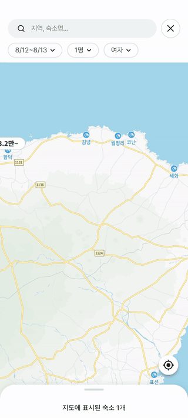

# 지도 타일링

> 지도를 드래그해도 서버를 때리지 않는 법

[← 목록으로](../README.md#문서)

---

## 문제

지도 화면은 이렇게 동작해야 합니다. 사용자가 지도를 움직이면, 그 화면에 보이는 숙소를 마커로 띄운다.

순진하게 만들면 이렇게 됩니다.

```
카메라 이동 콜백 → 현재 화면 경계 계산 → 서버에 "이 범위의 숙소 주세요" → 마커 갱신
```

문제는 **카메라 이동 콜백이 손가락이 움직이는 내내 불린다**는 것입니다. 서울에서 부산까지 한 번 쓸어내리면 요청이 수십 번 나갑니다. 그중 대부분은 이미 지나온, 방금 받아본 영역입니다.

여기에 두 가지가 겹칩니다.

- **줌 레벨에 따라 같은 화면 크기가 담는 실제 면적이 달라집니다.** 픽셀 기준으로 뭔가를 캐시할 수 없습니다.
- **SDK가 알려주는 경계와 실제로 눈에 보이는 영역이 다릅니다.** 화면은 직사각형이지만 지도는 기울어질 수 있고, 하단 바텀시트가 지도의 일부를 가립니다.

---

## 왜 단순 캐시로는 안 되나

가장 먼저 떠오르는 건 "요청한 경계를 키로 캐시하기"입니다. 하지만 경계는 **연속적인 실수 값**입니다.

```
요청 1: 위도 37.5001 ~ 37.5203, 경도 127.0102 ~ 127.0405
요청 2: 위도 37.5002 ~ 37.5204, 경도 127.0103 ~ 127.0406
```

사람 눈에는 같은 화면이지만 키로는 다릅니다. 캐시 적중률이 사실상 0입니다.

**핵심은 연속적인 좌표 문제를 이산적인 키 문제로 바꾸는 것**이었습니다.

---

## 01 · 격자를 깔다

한반도 전체에 고정된 격자를 깔고, 각 칸에 번호를 매깁니다. 이제 "이 화면에 필요한 데이터"는 좌표 범위가 아니라 **정수 ID의 집합**입니다.

```dart
static const double origin_north_lat = 38.6600;   // 격자 좌상단 위도
static const double origin_west_lng  = 125.5677;  // 격자 좌상단 경도
static const double lat_step = 0.09938;           // 한 칸의 세로 폭
static const double lng_step = 0.09886;           // 한 칸의 가로 폭
static const int columns_per_row = 43;            // 한 행의 열 개수
```

### 왜 10km 같은 깔끔한 단위가 아닌가

처음에는 "한 칸을 10km × 10km로 하자"고 생각했습니다. 그런데 이게 함정입니다.

위경도는 거리 단위가 아닙니다. 경도 1도가 담는 실제 거리는 위도에 따라 달라집니다(적도에서 가장 길고 극지방에서 0에 수렴). 격자를 거리 기준으로 잡으면 위도마다 칸의 위경도 폭이 달라지고, 그걸 매번 삼각함수로 환산해야 합니다. 실수 연산이 반복되면 오차가 쌓이고, **서버와 클라이언트가 같은 좌표에서 다른 칸 번호를 계산하는 순간 이 구조는 무너집니다.**

그래서 반대로 갔습니다. 거리를 목표로 두지 않고, "**서비스 범위를 약 2천 개 칸으로 나눈다**"는 목표를 먼저 세운 뒤 거기서 한 칸의 위경도 폭을 역산했습니다. 그 결과가 위의 소수점 값들입니다. 예쁘지 않지만, **덧셈과 나눗셈만으로 칸 번호가 나옵니다.**

최종적으로 **본토 2,021개 + 제주 45개, 합쳐서 2,066개**의 칸이 나왔습니다.

제주는 **격자를 따로 뒀습니다.** 본토 격자를 그대로 남쪽으로 늘리면 그 사이 바다까지 전부 칸으로 잡혀, 아무 숙소도 없는 칸을 수백 개 들고 있어야 합니다. 지리적으로 떨어져 있는 지역은 격자도 떼어 놓는 편이 낫습니다.

### 왜 줌에 따라 칸 크기를 바꾸지 않았나

줌인하면 칸을 잘게, 줌아웃하면 크게 — 적응형 격자는 직관적으로 좋아 보입니다. 하지만 캐시 관점에서는 최악입니다.

같은 지역이 줌 레벨마다 다른 ID를 갖게 되면, 줌을 한 번 바꿀 때마다 캐시가 통째로 무효화됩니다. 사용자는 지도를 보면서 줌을 계속 바꿉니다.

**고정 격자는 같은 숙소가 언제나 같은 칸에 귀속됩니다.** 캐시 키가 안정적이고, 서버도 칸별로 결과를 미리 계산해 둘 수 있습니다.

---

## 02 · 좌표를 번호로

행과 열을 구한 뒤 행 우선으로 1차원에 폅니다.

```dart
int tileIdOf(double lat, double lng) {
  final int row = ((origin_north_lat - lat) / lat_step).toInt();
  final int col = ((lng - origin_west_lng) / lng_step).toInt();
  return row * columns_per_row + col + 1;
}
```

화면 경계가 덮는 칸은 이중 루프로 모읍니다.

```dart
final int top    = ((origin_north_lat - north_lat) / lat_step).toInt();
final int bottom = ((origin_north_lat - south_lat) / lat_step).toInt();
final int left   = ((west_lng - origin_west_lng) / lng_step).toInt();
final int right  = ((east_lng - origin_west_lng) / lng_step).toInt();

for (int row = top; row <= bottom; row++) {
  for (int col = left; col <= right; col++) {
    tiles.add(row * columns_per_row + col + 1);
  }
}
```

경계에 걸친 칸은 **넉넉하게 포함시킵니다.** 몇 개를 더 가져오는 비용은 캐시와 후처리로 흡수되지만, **하나를 놓치면 그 자리에 숙소가 아예 안 뜨는 빈 구멍이 생깁니다.** 사용자는 "여기엔 숙소가 없구나"라고 오해합니다. 과하게 가져오는 쪽이 훨씬 싼 실수입니다.

> [!IMPORTANT]
> 서버와 클라이언트가 **같은 기준점과 같은 칸 크기**를 씁니다. 그래서 서버가 숙소 목록을 평평하게 내려줘도, 클라이언트가 각 숙소의 좌표로 칸 번호를 다시 계산하면 서버의 분류와 정확히 일치합니다. 좌표를 맞춰보는 과정이 필요 없습니다.

---

## 03 · 세 겹의 방어선

요청이 서버까지 가려면 관문 셋을 통과해야 합니다.

```
카메라 이동
    │
    ▼
① 디바운스 300ms ──────────▶ 아직 움직이는 중이면 취소
    │
    ▼
② 직전과 거의 같은 영역? ───▶ 그렇다면 여기서 종료
    │
    ▼
③ 필요한 칸 중 캐시에 없는 것만 추림
    │
    ├── 전부 캐시에 있음 ────▶ 네트워크 안 탐
    │
    ▼
   서버 요청 (없는 칸만)
```

### ① 디바운스

```dart
void onCameraMoveEnd() {
  debounce_timer?.cancel();
  debounce_timer = Timer(const Duration(milliseconds: 300), loadAccommodationsInBounds);

  updateVisibleCount();  // 마커 개수는 네트워크와 무관하므로 즉시 갱신
}
```

300ms는 몇 번 조정한 끝에 나온 값입니다. 더 길면 손을 뗐는데도 마커가 안 나와서 답답하고, 더 짧으면 드래그 도중에 요청이 새어 나갑니다.

중요한 건 **모든 걸 다 미루지는 않는다**는 점입니다. "이 화면에 숙소 N개" 같은 표시는 이미 받아둔 데이터로 계산할 수 있으므로 디바운스 없이 바로 갱신합니다. 사용자가 느끼는 반응성은 여기서 나옵니다.

### ② 유사 영역 판정

```dart
bool isSimilarBounds(SimpleLatLngBounds a, SimpleLatLngBounds b) {
  const double threshold = 0.0005;
  return (a.northeast.latitude  - b.northeast.latitude ).abs() < threshold &&
         (a.southwest.latitude  - b.southwest.latitude ).abs() < threshold &&
         (a.northeast.longitude - b.northeast.longitude).abs() < threshold &&
         (a.southwest.longitude - b.southwest.longitude).abs() < threshold;
}
```

지도를 살짝 건드려 경계가 미세하게 흔들리는 일이 잦습니다. 이 정도로는 칸 집합이 바뀌지 않으니 계산 자체를 건너뜁니다.

### ③ 칸 캐시

세 자료구조가 각각 다른 일을 합니다.

```dart
final Map<int, List<Accommodation>> tile_accommodation_cache = {};  // 데이터
final Map<int, DateTime> tile_cache_timestamps = {};                // 신선도
final Set<int> loaded_tiles = <int>{};                              // 적재 여부
static const Duration cache_expiration = Duration(minutes: 30);
```

유효성 판정은 키 존재 여부만 보지 않습니다.

```dart
bool isTileCached(int tile_id) {
  if (!tile_accommodation_cache.containsKey(tile_id)) return false;

  final timestamp = tile_cache_timestamps[tile_id];
  if (timestamp != null && DateTime.now().difference(timestamp) < cache_expiration) {
    return true;
  }

  // 만료를 발견한 그 자리에서 세 곳 모두에서 지운다
  tile_accommodation_cache.remove(tile_id);
  tile_cache_timestamps.remove(tile_id);
  loaded_tiles.remove(tile_id);
  return false;
}
```

**유효성 검사와 청소를 한 흐름에 묶어 뒀습니다.** 만료된 항목은 다음번에 조회될 때 자연스럽게 제거되므로, 별도의 청소 타이머를 돌릴 필요가 없습니다.

> [!TIP]
> 응답이 비어 있어도 **빈 리스트로 캐시합니다.** 그러지 않으면 숙소가 없는 지역(바다, 산간)을 지날 때마다 같은 요청을 반복하게 됩니다. "없다는 사실"도 캐시할 가치가 있는 정보입니다.

---

## 04 · 넓게 받고 좁게 그리기

칸은 화면보다 넓게 가져옵니다. 그대로 그리면 화면 밖 숙소까지 마커가 생깁니다.

그래서 **요청은 칸 단위로 넓게, 렌더링은 다각형 단위로 좁게** 합니다.

화면 네 귀퉁이의 화면 좌표를 위경도로 변환해 다각형을 만들고, 그 안에 들어오는 숙소만 그립니다. 다각형은 항상 네 점이므로 판정 비용이 예측 가능합니다.

```dart
bool isPointInPolygon(double lat, double lng, List<LatLng> polygon) {
  // 1차: 경계 상자로 빠르게 걸러낸다 (대부분 여기서 탈락)
  if (lat < min_lat || lat > max_lat || lng < min_lng || lng > max_lng) {
    return false;
  }

  // 2차: 통과한 점에만 Ray-Casting 적용
  bool is_inside = false;
  for (int i = 0, j = 3; i < 4; j = i++) {
    final yi = polygon[i].latitude;
    final yj = polygon[j].latitude;

    if ((yi > lat) != (yj > lat)) {
      if (yi == yj) continue;   // 0으로 나누기 방지
      // 나눗셈은 조건을 통과한 뒤에만 수행
      if (lng < (xj - xi) * (lat - yi) / (yj - yi) + xi) {
        is_inside = !is_inside;
      }
    }
  }
  return is_inside;
}
```

싼 검사를 먼저 하고 비싼 연산을 뒤로 미루는 게 전부입니다. 대부분의 점은 경계 상자에서 탈락하므로 삼각비 없는 뺄셈 몇 번으로 끝납니다.

<div align="center">
<br>
<sub>개발 중 격자와 타일 번호를 화면에 그려 검증하던 모습 · 실제 앱에서는 보이지 않습니다</sub>
</div>

<br>

지도를 움직이면 화면에 걸치는 타일 번호가 바뀝니다. 하단의 "지도에 표시된 숙소 N개"가 바로 이 다각형 필터를 통과한 개수입니다. 개발 중에는 이렇게 격자와 번호를 직접 그려 놓고, **경계에 걸친 타일이 빠지지 않는지**를 눈으로 확인했습니다.

---

## 05 · 실제로 얼마나 줄었나

글로만 쓰면 믿기 어려우니 직접 재봤습니다. 지도 화면에서 좌우로 **16번 드래그**하면서 로그를 수집했습니다.

<div align="center">
<br>
<sub>측정에 사용한 조작 · 제주 동부에서 좌우로 반복 드래그</sub>
</div>

<br>

| | 결과 |
|---|---|
| 드래그 후 로드 시도 (디바운스·유사 영역 판정 통과) | **16회** |
| 그중 서버 호출이 실제로 나간 횟수 | **1회** |
| 전부 캐시로 해결돼 네트워크를 타지 않은 횟수 | **15회** |
| 화면이 덮은 타일 (누적) | **64개** |
| 그중 캐시 적중 | **61개** |
| 실제로 서버에 요청한 타일 | **3개** |

**타일 캐시 적중률 95.3%**, 로드 시도 대비 **서버 호출 6.3%**입니다.

숫자를 읽는 법이 하나 있습니다. 16번의 드래그가 모두 "데이터가 필요한 상황"으로 판정됐다는 뜻입니다. 즉 디바운스와 유사 영역 판정이 이미 걸러낸 뒤에도 16번은 진짜로 조회가 필요했고, **그 16번 중 15번을 캐시가 받아냈습니다.**

같은 지역을 오가는 조작이라 적중률이 높게 나온 면이 있습니다. 처음 보는 지역으로 계속 이동하면 당연히 낮아집니다. 다만 지도를 쓰는 실제 행동이 대개 **한 지역을 들여다보며 왔다 갔다 하는 것**이라, 이 패턴에서 잘 듣는다는 것 자체가 설계 의도와 맞습니다.

> [!NOTE]
> 측정은 서버가 내려간 뒤라 **목 서버를 끼운 빌드**로 했습니다. 요청 횟수와 캐시 적중은 클라이언트 로직만으로 결정되므로 서버 종류와 무관하지만, 응답 지연이 없는 환경이라는 점은 감안해야 합니다.

### 계산 비용

| 단계 | 비용 | 비고 |
|---|---|---|
| 칸 ID 생성 | 화면이 덮는 칸 수에 비례 | 줌아웃해도 수십 개 수준 |
| 캐시 판정 | 칸 수에 비례 | Map 조회 |
| 가시 영역 필터 | 캐시된 숙소 수에 비례 | 대부분 경계 상자에서 탈락 |

전부 선형이고, 상수가 작습니다. 실제로 무거운 건 계산이 아니라 **네트워크 요청과 마커 위젯 생성**이며, 위 수치가 보여주듯 이 구조는 정확히 그 둘을 줄입니다.

---

## 트레이드오프

| 선택 | 얻은 것 | 감수한 것 |
|---|---|---|
| 고정 격자 | 캐시 키가 안정적 · 서버 사전 계산 가능 | 서비스 범위가 넓어지면 상수를 다시 설계해야 함 |
| 클라이언트 메모리 캐시 | 중복 요청 급감 · 드래그가 부드러움 | 앱을 오래 켜 두면 메모리를 계속 점유 |
| 다각형 후처리 | 진짜 보이는 것만 그림 | 화면 좌표 변환이 실패할 때의 대비책 필요 |

**가장 아쉬운 점은 칸의 밀도가 균등하지 않다는 것입니다.** 서울 도심 한 칸에는 숙소가 수십 개 들어가고, 강원도 산간 한 칸에는 하나도 없습니다. 도심에서는 한 칸이 여전히 무겁고, 시골에서는 빈 칸을 잔뜩 조회합니다.

다시 만든다면 **도심에만 하위 칸을 두는 하이브리드 격자**를 고려할 것 같습니다. 다만 그러면 "같은 지역은 항상 같은 ID"라는 지금 구조의 가장 큰 장점을 일부 포기해야 하므로, 실제 트래픽 분포를 보고 판단할 문제입니다.

---

## 마치며

이 작업의 결론은 이렇게 정리됩니다.

> **연속 좌표 문제를 정적 타일 키 문제로 바꾸고, 요청은 타일 단위로 넓게, 렌더링은 다각형 단위로 좁게 처리한다.**

성능 최적화라고 하면 보통 실행 속도를 깎는 일을 떠올립니다. 그런데 여기서 실제로 한 일은 **하지 않아도 될 연산을 구조적으로 막는 것**에 가까웠습니다. 가장 빠른 요청은 나가지 않는 요청입니다.

---

**관련 코드** → [`src/map_tiling.dart`](../src/map_tiling.dart)
**관련 글** → [지도를 '그리지 않음'으로써 가장 빠른 지도를 그리는 법](https://yeohaenghage.kr/frontend/map_tiling)
**다음 문서** → [상태 관리](03-state-management.md)
